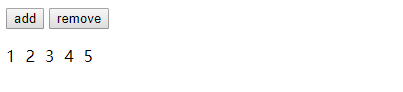
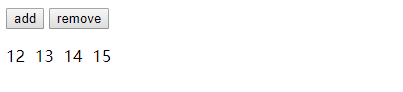

## render函数 vnode
1. transition组件使用同插槽一样，调用 transition 组件的render方法，通过 `this.$slots.default` 取得内部的vnode
2. 在 vnode的data上 生成 transition对象，保存transition标签上的 props （例如 name），listeners等属性 `vnode.data.transition`

```js
const data: Object = (child.data || (child.data = {})).transition = extractTransitionData(this)

// 取出 transition组件 过渡动画所需的属性
export function extractTransitionData (comp: Component): Object {
  const data = {}
  const options: ComponentOptions = comp.$options
  // props
  for (const key in options.propsData) {
    data[key] = comp[key]
  }
  // events.
  // extract listeners and pass them directly to the transition methods
  const listeners: ?Object = options._parentListeners
  for (const key in listeners) {
    data[camelize(key)] = listeners[key]
  }
  return data
}
```
通过该方法在子组件上添加动画css名，这样 child.data.transition 中就包含了过渡所需的一些数据

> 如果组件里面写了html语言（不是正常插槽的写法），那么会作为 _c的 children vnode 传入，最终vnode保存在 componentOptions.children，在 _init过程中 
  * 合并component配置的过程中，` opts._renderChildren = vnodeComponentOptions.children;`，
  * initRender 将 opts._renderChildren 挂载到 vm.$slots.default 上
 
## 钩子函数

patch 过程中 执行 invokeCreateHooks ，来调用 vnode的 create 钩子函数 里的 _enter，所以会执行enter方法，来进行 进入动画的处理 
```js
function _enter (_: any, vnode: VNodeWithData) {
  if (vnode.data.show !== true) {
    enter(vnode)
  }
}


export default inBrowser ? {
  create: _enter,
  activate: _enter,
  remove (vnode: VNode, rm: Function) {
    /* istanbul ignore else */
    if (vnode.data.show !== true) {
      leave(vnode, rm)
    } else {
      rm()
    }
  }
} : {}
```
提供了3个钩子函数

## enter方法

1. 从 vnode.data.transition 获取 name ，并生成css名
2. 获取 css ,如果 已经显示的定义了这些属性就会覆盖默认的 class 名

默认类名， 为 transition name + 后缀
```js
{
    enterClass: `${name}-enter`,
    enterToClass: `${name}-enter-to`,
    enterActiveClass: `${name}-enter-active`,
    leaveClass: `${name}-leave`,
    leaveToClass: `${name}-leave-to`,
    leaveActiveClass: `${name}-leave-active`
  }
```

自定义类名
```js
<transition
    name="custom-classes-transition"
    enter-active-class="animated tada"
    leave-active-class="animated bounceOutRight"
  >
```


执行顺序
1. 执行 beforeEnterHook 钩子函数
    * addClass (startClass,activeClass)
    * nextFrame 
        * removeClass(startCLass)
        * addClass (toClass)
        * 如果 设置了 duration ，`setTimeout(cb, explicitEnterDuration)`
        * 否则 等待动画（transitionEndEvent 或 animationEndEvent）结束 `whenTransitionEnds(el, type, cb)`,执行回调函数

2. nextFrame调用回调函数 定义了 动画结束的回调函数 cb ,执行 afterEnterHook 钩子函数，并置 el._enterCb = null
  * removeClass(activeClass,toClass)
  * afterEnterHook 钩子函数
  * el._enterCb = null

```js
const startClass = isAppear && appearClass
    ? appearClass
    : enterClass
const activeClass = isAppear && appearActiveClass
  ? appearActiveClass
  : enterActiveClass
const toClass = isAppear && appearToClass
  ? appearToClass
  : enterToClass

const beforeEnterHook = isAppear
  ? (beforeAppear || beforeEnter)
  : beforeEnter
const enterHook = isAppear
  ? (typeof appear === 'function' ? appear : enter)
  : enter
const afterEnterHook = isAppear
  ? (afterAppear || afterEnter)
  : afterEnter
const enterCancelledHook = isAppear
  ? (appearCancelled || enterCancelled)
  : enterCancelled

const explicitEnterDuration: any = toNumber(
  isObject(duration)
    ? duration.enter
    : duration
)

if (process.env.NODE_ENV !== 'production' && explicitEnterDuration != null) {
  checkDuration(explicitEnterDuration, 'enter', vnode)
}

const expectsCSS = css !== false && !isIE9
const userWantsControl = getHookArgumentsLength(enterHook)


  el = vnode.elm
  const cb = el._enterCb = once(() => {
    if (expectsCSS) {
      removeTransitionClass(el, toClass)
      removeTransitionClass(el, activeClass)
    }
    if (cb.cancelled) {
      if (expectsCSS) {
        removeTransitionClass(el, startClass)
      }
      enterCancelledHook && enterCancelledHook(el)
    } else {
      afterEnterHook && afterEnterHook(el)
    }
    el._enterCb = null
  })


beforeEnterHook && beforeEnterHook(el)
  if (expectsCSS) {
    addTransitionClass(el, startClass)
    addTransitionClass(el, activeClass)
    nextFrame(() => {
      removeTransitionClass(el, startClass)
      if (!cb.cancelled) {
        addTransitionClass(el, toClass)
        if (!userWantsControl) {
          if (isValidDuration(explicitEnterDuration)) {
            setTimeout(cb, explicitEnterDuration)
          } else {
            whenTransitionEnds(el, type, cb) //添加 事件 transitionEndEvent 或 animationEndEvent
          }
        }
      }
    })
  }

const raf = inBrowser
  ? window.requestAnimationFrame
    ? window.requestAnimationFrame.bind(window)
    : setTimeout
  : fn => fn()

export function nextFrame (fn: Function) {
  raf(() => {
    raf(fn)
  })
}

//whenTransitionEnds
export function whenTransitionEnds (
  el: Element,
  expectedType: ?string,
  cb: Function
) {
  const { type, timeout, propCount } = getTransitionInfo(el, expectedType)
  if (!type) return cb()
  const event: string = type === TRANSITION ? transitionEndEvent : animationEndEvent
  let ended = 0
  const end = () => {
    el.removeEventListener(event, onEnd)
    cb()
  }
  const onEnd = e => {
    if (e.target === el) {
      if (++ended >= propCount) {
        end()
      }
    }
  }
  setTimeout(() => {
    if (ended < propCount) {
      end()
    }
  }, timeout + 1)
  el.addEventListener(event, onEnd)
}
```
对于过渡类名方面，startClass 定义进入过渡的开始状态，在元素被插入时生效，在下一个帧移除；activeClass 定义过渡的状态，在元素整个过渡过程中作用，在元素被插入时生效，在 transition/animation 完成之后移除；toClass 定义进入过渡的结束状态，在元素被插入一帧后生效 (与此同时 startClass 被删除)，在 `<transition>/animation` 完成之后移除。

对于过渡钩子函数方面，beforeEnterHook 是过渡开始前执行的钩子函数，enterHook 是在元素插入后或者是 v-show 显示切换后执行的钩子函数。afterEnterHook 是在过渡动画执行完后的钩子函数。

explicitEnterDuration 表示 enter 动画执行的时间。

expectsCSS 表示过渡动画是受 CSS 的影响。

cb 定义的是过渡完成执行的回调函数。


3. vnode添加 insert => enterHook钩子函数，在patch过程中 invokeInsertHook时，来执行 enter 钩子函数
```js
const enterHook = isAppear
    ? (typeof appear === 'function' ? appear : enter)
    : enter
    
mergeVNodeHook(vnode, 'insert', () => {
      const parent = el.parentNode
      const pendingNode = parent && parent._pending && parent._pending[vnode.key]
      if (pendingNode &&
        pendingNode.tag === vnode.tag &&
        pendingNode.elm._leaveCb
      ) {
        pendingNode.elm._leaveCb()
      }
      enterHook && enterHook(el, cb)
    })
```
enterHook 就是用户自定义的钩子函数
```js
 enter: function (el, done) {
    // ...
    done()
  },
```
第二个参数 done 就是 动画执行结束的回调函数 cb


> vue 管理动画类名，而不是直接产生动哈

## leave
在删除节点时，调用 removeAndInvokeRemoveHook remove钩子，就会执行 transition组件的leave(vnode, rm) 方法

```js
  const {
    css,
    type,
    leaveClass,
    leaveToClass,
    leaveActiveClass,
    beforeLeave,
    leave,
    afterLeave,
    leaveCancelled,
    delayLeave,
    duration
  } = data

    const cb = el._leaveCb = once(() => {
    if (el.parentNode && el.parentNode._pending) {
      el.parentNode._pending[vnode.key] = null
    }
    if (expectsCSS) {
      removeTransitionClass(el, leaveToClass)
      removeTransitionClass(el, leaveActiveClass)
    }
    if (cb.cancelled) {
      if (expectsCSS) {
        removeTransitionClass(el, leaveClass)
      }
      leaveCancelled && leaveCancelled(el)
    } else {
      rm()
      afterLeave && afterLeave(el)
    }
    el._leaveCb = null
  })
```
如果进入动画还没结束，则调用  `el._enterCb.cancelled = true el._enterCb() `来取消动画
1. 执行 performLeave方法，
    * beforeLeave 钩子函数
    * 添加class addClass(leaveClass,leaveActiveClass)
    * nextFrame
        * 移除 leaveClass
        * addClass(leaveToClass);
        * 等待动画执行结束 ，执行 结束回调函数
    * 执行 leave 钩子
      * removeClass(leaveToClass,leaveActiveClass)
      * afterLeave 钩子函数
      * el._leaveCb = null
```js
function performLeave () {
      // the delayed leave may have already been cancelled
      if (cb.cancelled) {
        return
      }
      // record leaving element
      if (!vnode.data.show && el.parentNode) {
        (el.parentNode._pending || (el.parentNode._pending = {}))[(vnode.key)] = vnode;
      }
      beforeLeave && beforeLeave(el);
      if (expectsCSS) {
        addTransitionClass(el, leaveClass);
        addTransitionClass(el, leaveActiveClass);
        nextFrame(function () {
          removeTransitionClass(el, leaveClass);
          if (!cb.cancelled) {
            addTransitionClass(el, leaveToClass);
            if (!userWantsControl) {
              if (isValidDuration(explicitLeaveDuration)) {
                setTimeout(cb, explicitLeaveDuration);
              } else {
                whenTransitionEnds(el, type, cb);
              }
            }
          }
        });
      }
      leave && leave(el, cb); // 自定义 leave方法
      if (!expectsCSS && !userWantsControl) {
        cb();
      }
    }
```

2. 回调函数定义
    * 移除class (leaveToClass,leaveActiveClass)

    * afterLeave 钩子
```js
var cb = el._leaveCb = once(function () {
      if (el.parentNode && el.parentNode._pending) {
        el.parentNode._pending[vnode.key] = null;
      }
      if (expectsCSS) {
        removeTransitionClass(el, leaveToClass);
        removeTransitionClass(el, leaveActiveClass);
      }
      if (cb.cancelled) {
        if (expectsCSS) {
          removeTransitionClass(el, leaveClass);
        }
        leaveCancelled && leaveCancelled(el);
      } else {
        rm();
        afterLeave && afterLeave(el);
      }
      el._leaveCb = null;
    });
```

## nextFrame 
是 requestAnimationFrame 的简单实现

当你准备更新动画时你应该调用此方法。这将使浏览器在下一次重绘之前调用你传入给该方法的动画函数(即你的回调函数)。回调函数执行次数通常是每秒60次，通过这个api,可以告诉浏览器某个JavaScript代码要执行动画，浏览器收到通知后，则会运行这些代码的时候进行优化，实现流畅的效果，而不再需要开发人员烦心刷新频率的问题了。

vue使用 nextFrame 是为了让 dom先添加上 enter-active class ，再添加 enter-to class,避免动画直接到末尾

## transition-group
transition-group 组件 在调用beforeMount钩子函数时，修改 _update 方法
```js
beforeMount () {
    debugger;
    const update = this._update
    this._update = (vnode, hydrating) => {
      const restoreActiveInstance = setActiveInstance(this)
      // force removing pass
      this.__patch__(
        this._vnode,
        this.kept, //新旧都存在的vnode
        false, // hydrating
        true // removeOnly (!important, avoids unnecessary moves)
      )//将两次都存在的列表项进行patch，先删除需要删除的节点
      this._vnode = this.kept
      restoreActiveInstance()
      update.call(this, vnode, hydrating) // 插入的节点 各个表项移动到 最终的位置，保证被移动的节点依旧在原来相对的位置
    }
  },
```
### render
transition-group作为一个组件 patch过程中 调用 createComponent方法生成vue实例，再调用mount方法生产vnode，其中调用了其render方法
* 获取 tag 类型   this.$vnode.data.tag
* map对象保存当前表项 {key:vnode}
* prevChildren 上一次表项
* children 本次表项 `[vnode]`
* rawChildren 插槽的子vnode数组 this.$slots.default
* c.data.transitionData 类名 = extractTransitionData(this)

`(c.data || (c.data = {})).transition = transitionData`
为每个子节点添加 transition属性，为了能在 enter 方法中识别到该vnode要进行动画渲染


* 比较新旧 vnode 列表
  * 相同的 加入到 kept数组
  * 不同的，需要从旧列表中移除的 加入到 remove数组
  
```js
this.kept = h(tag, null, kept)
this.removed = removec
```

*  return 生成 vnode  `h(tag, null, children)`

```js

render (h: Function) {
     const tag: string = this.tag || this.$vnode.data.tag || 'span'
    const map: Object = Object.create(null)
    const prevChildren: Array<VNode> = this.prevChildren = this.children
    const rawChildren: Array<VNode> = this.$slots.default || []
    const children: Array<VNode> = this.children = []
    const transitionData: Object = extractTransitionData(this)

    for (let i = 0; i < rawChildren.length; i++) {
      const c: VNode = rawChildren[i]
      if (c.tag) {
        if (c.key != null && String(c.key).indexOf('__vlist') !== 0) {
          children.push(c)
          map[c.key] = c
          ;(c.data || (c.data = {})).transition = transitionData
        } else if (process.env.NODE_ENV !== 'production') {
          const opts: ?VNodeComponentOptions = c.componentOptions
          const name: string = opts ? (opts.Ctor.options.name || opts.tag || '') : c.tag
          warn(`<transition-group> children must be keyed: <${name}>`)
        }
      }
    }

    if (prevChildren) {
      const kept: Array<VNode> = []
      const removed: Array<VNode> = []
      for (let i = 0; i < prevChildren.length; i++) {
        const c: VNode = prevChildren[i]
        c.data.transition = transitionData
        c.data.pos = c.elm.getBoundingClientRect() // 位置坐标
        if (map[c.key]) {
          kept.push(c)
        } else {
          removed.push(c)
        }
      }
      this.kept = h(tag, null, kept)
      this.removed = removed
    }

    return h(tag, null, children)
  },
```
### update
```js
const update = this._update
this._update = (vnode, hydrating) => {
      const restoreActiveInstance = setActiveInstance(this)
      // force removing pass
      this.__patch__(
        this._vnode,
        this.kept,
        false, // hydrating
        true // removeOnly (!important, avoids unnecessary moves)
      )//将两次都存在的列表项进行patch，先删除需要删除的节点
      this._vnode = this.kept
      restoreActiveInstance()
      update.call(this, vnode, hydrating) // 插入的节点 各个表项移动到 最终的位置，保证被移动的节点依旧在原来相对的位置
    }
```
执行destory 钩子函数，也就是执行了 transition的 leave方法，为每一个子节点添加动画css，这一部分和 transition相同

执行 create 钩子函数，也就是执行了 transiotion 的 enter方法，为每一个子节点添加动画css，这一部分和 transition相同

> 与 transition 不同的是 transition-group会生成一个dom节点，包裹住内部的列表，而transition是一个虚结点。


### 添加表项

* 生成新的vnode，进行patch，在比较新旧节点的过程中，调用了 prePatch ，再调用 updateChildComponent,其中比较重要的步骤 （和keep-alive相同）

```js
vm.$options._renderChildren = renderChildren;  //替换成新的 插槽内容

if (needsForceUpdate) {
      vm.$slots = resolveSlots(renderChildren, parentVnode.context); //更新 vm.$slots 
      vm.$forceUpdate(); //重新渲染 <transition-group>实例
    } 
```

* 调用 transition-group 的 render函数，通过this.$slots.default拿到新的插槽内容，更新 c，kept，remove

* 执行 transiton-group 实例的 _update
  * kept 和 旧节点 个数相同， 执行patch无变化
```js
this._update = (vnode, hydrating) => {
      const restoreActiveInstance = setActiveInstance(this)
      // force removing pass
      this.__patch__(
        this._vnode,
        this.kept,
        false, // hydrating
        true // removeOnly (!important, avoids unnecessary moves)
      )//将两次都存在的列表项进行patch，先删除需要删除的节点
      this._vnode = this.kept // 修改 transition-group 实例的 渲染vnode
      restoreActiveInstance()
      update.call(this, vnode, hydrating) // 插入的节点 各个表项移动到 最终的位置，保证被移动的节点依旧在原来相对的位置
    }
```

其中比较重要的： `this._vnode = this.kept`

  * 再次调用 **原生 _update**,渲染新的 dom，以及他们的动画 (按 transition 处理)

* 在 更新watcher队列 执行完后会调用 **transition-group 的 updated 钩子 函数**，主要实现了 其他表项的移动动画
```js
function callUpdatedHooks (queue) {
    var i = queue.length;
    while (i--) {
      var watcher = queue[i];
      var vm = watcher.vm;
      if (vm._watcher === watcher && vm._isMounted && !vm._isDestroyed) {
        callHook(vm, 'updated');
      }
    }
  }

function callHook (vm, hook) {
    // #7573 disable dep collection when invoking lifecycle hooks
    pushTarget();
    var handlers = vm.$options[hook];
    var info = hook + " hook";
    if (handlers) {
      for (var i = 0, j = handlers.length; i < j; i++) {
        invokeWithErrorHandling(handlers[i], vm, null, vm, info);
      }
    }
    if (vm._hasHookEvent) {
      vm.$emit('hook:' + hook);
    }
    popTarget();
  }

// transition-group update
    updated () {  //其他列表项的缓动动画 
     const children: Array<VNode> = this.prevChildren
    const moveClass: string = this.moveClass || ((this.name || 'v') + '-move')
    if (!children.length || !this.hasMove(children[0].elm, moveClass)) {
      return
    }

    // we divide the work into three loops to avoid mixing DOM reads and writes
    // in each iteration - which helps prevent layout thrashing.
    children.forEach(callPendingCbs)
    children.forEach(recordPosition)
    children.forEach(applyTranslation)

    // force reflow to put everything in position
    // assign to this to avoid being removed in tree-shaking
    // $flow-disable-line
    this._reflow = document.body.offsetHeight // ！！触发浏览器重绘

    children.forEach((c: VNode) => {
      if (c.data.moved) {
        const el: any = c.elm
        const s: any = el.style
        addTransitionClass(el, moveClass)
        s.transform = s.WebkitTransform = s.transitionDuration = '' // 移掉 transform
        el.addEventListener(transitionEndEvent, el._moveCb = function cb (e) {
          if (e && e.target !== el) {
            return
          }
          if (!e || /transform$/.test(e.propertyName)) {
            el.removeEventListener(transitionEndEvent, cb)
            el._moveCb = null
            removeTransitionClass(el, moveClass)
          }
        })
      }
    })
  },  
```

### v-move
主要是为了 生成其他表项的移动动画，

####hasMove
hasMove 的判断，首先克隆一个 DOM 节点，然后为了避免影响，移除它的所有其他的过渡 Class；接着添加了 moveClass 样式，设置 display 为 none，添加到组件根节点上；

首先会判断是否设置了 move相关属性，再判断move相关属性的css是否涉及到了 动画的css属性

为每一个子节点,防止连续多次点击，让前一个动画 结束
```js
function callPendingCbs (c: VNode) {
  /* istanbul ignore if */
  if (c.elm._moveCb) {
    c.elm._moveCb()
  }
  /* istanbul ignore if */
  if (c.elm._enterCb) {
    c.elm._enterCb()
  }
}
```

记录新的el 位置坐标
```js
function recordPosition (c: VNode) {
  c.data.newPos = c.elm.getBoundingClientRect()
}
```

根据新旧位置的距离，来设置动画，先将每一个表项移动到之前的位置
```js
function applyTranslation (c: VNode) {
  const oldPos = c.data.pos
  const newPos = c.data.newPos
  const dx = oldPos.left - newPos.left
  const dy = oldPos.top - newPos.top
  if (dx || dy) {
    c.data.moved = true
    const s = c.elm.style
    s.transform = s.WebkitTransform = `translate(${dx}px,${dy}px)`
    s.transitionDuration = '0s'
  }
}

```

```js
this._reflow = document.body.offsetHeight; // 触发浏览器回流重绘 防止 在 tree-shaking的时候被删除

children.forEach((c: VNode) => {
      if (c.data.moved) {
        const el: any = c.elm
        const s: any = el.style
        addTransitionClass(el, moveClass) // 设置 move 的 css 动画效果
        s.transform = s.WebkitTransform = s.transitionDuration = '' // 移掉 transform
        el.addEventListener(transitionEndEvent, el._moveCb = function cb (e) {
          if (e && e.target !== el) {
            return
          }
          if (!e || /transform$/.test(e.propertyName)) {
            el.removeEventListener(transitionEndEvent, cb)
            el._moveCb = null
            removeTransitionClass(el, moveClass)
          }
        })
      }
    })
```

## 删除表项
在 update过程中 ， kept和旧的表项不相同，在执行 `__patch__` 的过程中，先删除要删除的点，再次调用 _update

### 第一次patch 移除节点 第二次 _update 添加和移动节点
这样删除的节点就会在原来的位置开始移除动画，添加的节点也是

如果直接 进行 _update操作，那么在patch的过程中 不能保证表项中每一个的相对位置保存不变

比如 在头部插入一项并且尾部删除一项,最后生产的列表如下，第一个项被移动到了最后一个，在为其添加move动画时，他是相对原来在第一个的位置进行移动
```js
var children = this.prevChildren;

c.data.newPos = c.elm.getBoundingClientRect();

var oldPos = c.data.pos;
var newPos = c.data.newPos;  
var dx = oldPos.left - newPos.left;
var dy = oldPos.top - newPos.top; 
```
如果仅通过一次patch，第一个位置的 1 被移动到了 最后一个，那么在添加move动画时，1是相对与第一个位置进行移动到最后一个位置。  

例如：

```js
[1,2,3,4,5] => [2,3,4,5,6]

[2,3,4,5,6,1] //在进行到需要删除1时，1在最后一位

// 分两次patch
[1,2,3,4,5] => [2,3,4,5]

[2,3,4,5] => [2,3,4,5,6]
```
正常情况



不正常情况




调用 remove 钩子函数，和 transition相同

### 总结
transition-group 在渲染时调用 $mount前，会先执行 自定义的beforeUpdate钩子函数，修改了当前实例的 _update 方法，（先执行自定义的_update方法做第一次patch，再执行原生update 做第二次patch 进行渲染生成移入 移出 动画）。在渲染完毕后，会执行 自定义的 updated 钩子函数，进行其他表项移动动画的生成